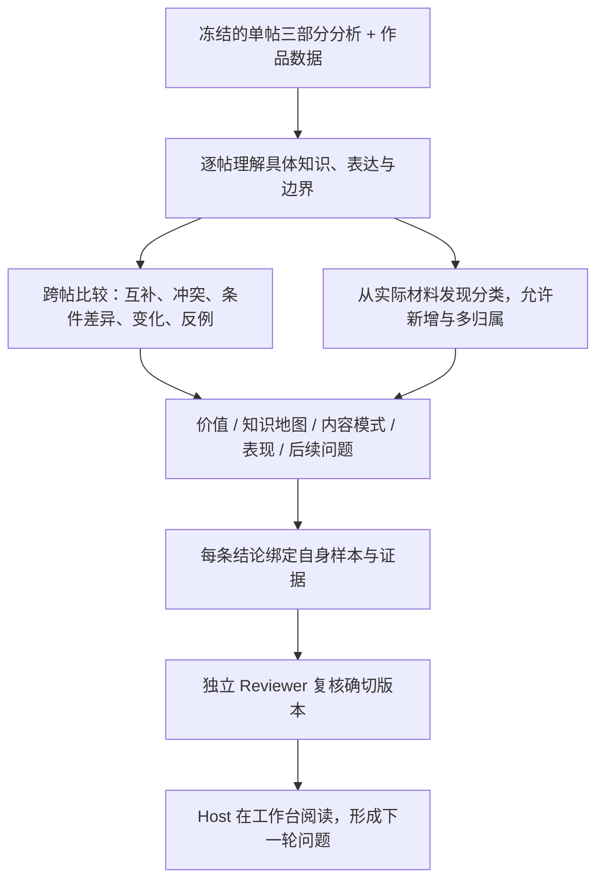

# 博主综合：从单帖知识到内容系统

目标是让读者快速理解这个博主：提供了什么具体知识与价值，内容之间有什么关系，哪些模式成立或有反例，以及还有什么值得研究。单帖深度分析是主体，作品分布是背景和比较依据。

执行前完整阅读 [分析方法](references/method.md)。第一次使用或需要理解方法由来时，阅读 [实际案例](references/example.md)。执行服务直接注入前两份文件时，视为已加载；案例用于理解方法，不是当前博主的事实来源。

## 先确认本次交付方式

| 调用方指定的任务 | Builder 交付 |
| --- | --- |
| 新博主或完整重建 | 完整综合候选，含实际冻结清单的分类、逐帖记录与跨帖研究 |
| 同输入复用 | 重新阅读完整单帖材料，只写指定研究草稿；程序复用通过绑定校验的分类与逐帖固定记录 |
| 有明确问题的局部修订 | 在指定候选及字段范围内修订，保留输入版本和修改依据；通过候选导入、校验与独立复核后才成为正式结果 |

复用必须由执行服务明确提供并校验，不能因看见旧报告就自行选择。输入变化不能沿用同输入复用；导入候选也不能声称由本次 CLI 加载 skill 生成。临时研究问题用于检验假设，不是必须得到的结论。

新 dynamic workflow 的独立审阅使用 [Reviewer 方法](references/reviewer-operator.md)：有意见才进行一次 Builder 修订，无意见跳过；修订稿保留未独立复核状态，执行错误单独恢复。

## 角色与交付

- Builder 只写调用方指定的综合候选，使用调用方给出的 Schema、冻结输入、来源解析方式与输出路径。不得改写单帖、评估结果或原始证据。
- Reviewer 独立检查来源与推断，不替 Builder 补结论；Host 实际阅读产品并决定后续工作。Builder 自查不等于独立通过。
- 缺失关键输入时明确指出缺失文件或字段，不借旧报告补事实。单帖已构建与已验证要区分；来源修订后旧评估不能自动继承。
- 本产物研究博主本身。用户未来创作是用途背景，不在此生成我们的标题、封面、选题、发布或实验方案。

本 skill 项目内维护；执行器负责队列、模型选择、输入版本、Schema 与证据校验。不要另起采集工作流或调用旧的全流程分析 skill。
