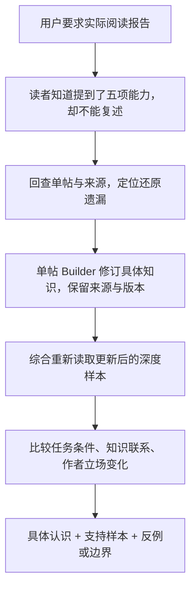

# 例子：从“表达套路”回到具体知识

## 场景

用户希望把工作台作为理解博主和学习内容的研究工具。单帖与博主综合已有产物后，用户要求 Host 作为读者检查：获得了什么认知、还有哪些疑问、认知摆放是否合理。

这次研究对象是单车酒吧搞机社。以下例子只用于解释分析方法；它不是新博主的证据，不可套用其结论。

## 对综合方法的改变

**知识不能由表达结构代替。** “定义→标准→案例”说明怎样讲，不说明五项能力是什么。综合应指向已还原的具体判据及案例关系；若单帖仍遗漏，明确回交修订，不写成已解决。

**差异不能一律抹平成一致。** 前次候选比较了低成本32B配置与后来的Mac帖子。前者对部分Mac使用场景持保留意见，后者通过新的优化与负载条件更新判断。正确的综合保留立场变化和任务差异，而不是声称两篇从来没有张力；技术数字仍属于作者主张。

**数字和表格背后有条件。** “能跑”与“持续可用”涉及插槽、显示输出、散热、长期负载与维护；文生视频的单卡门槛与另一任务的多卡方案不应无条件互相套用。综合价值在于建立这些条件关系，不是再输出一份设备清单。

**来源变了，综合也要跟着变。** 早期综合依赖的单帖修订后，应冻结新输入并重新复核，不能继承旧版“通过”。修订稿的媒体相对路径可能仍基于原始资源目录，引用正文与解析图片要分别按运行时约定处理。

这些是本项目的经验与候选中的具体分析方式，不构成跨项目已验证的因果规律。完整会话取证范围、行号与限制见 [本次沉淀记录](../../../../docs/development/creator-synthesis-skill-harvest-2026-09-15.md)。
