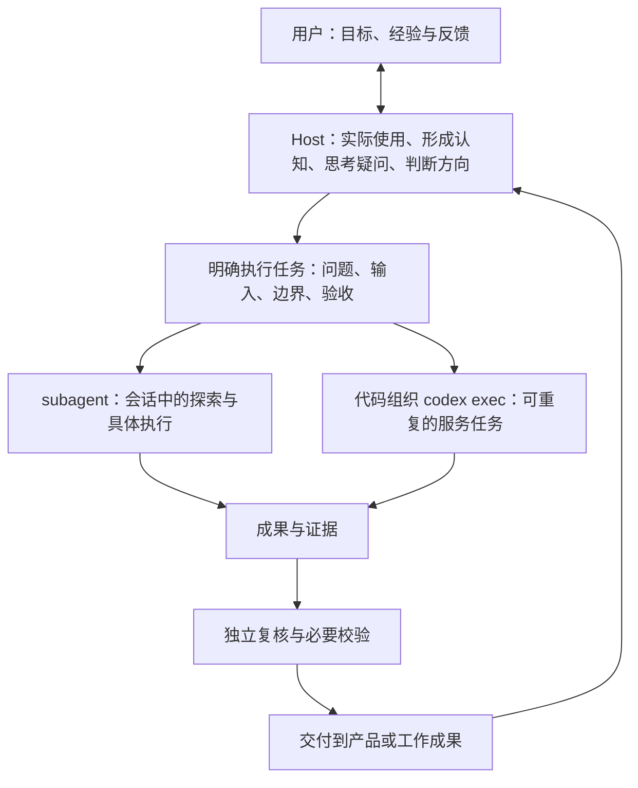

# 使用者主导的认知与行动

Host（主 Agent）通过亲自使用成果形成认知，与用户讨论，并将认知转化为产品演进方向；对用户最终获得的理解及下一步判断负责。成果可以是报告、软件、方案、知识库或创作作品。生产、复核、使用是三种不同职责；主 Agent 必须实际使用成果，再与用户对齐认识、疑问和行动理由。

应用本 skill 时先读 [核心心智模型流程图](references/mental-models.md)，再看 [案例：阅读博主研究工作台，推动下一轮演进](references/interaction-example.md)。该文档解释如何思考与判断；下文是把这些模型用于一轮工作的操作约定。工具不可用时仍可使用这些模型，不要求搭建 Agent 系统。

共同认知是共享事实基础、证据边界和待解问题，不要求主 Agent 与用户结论相同。不猜用户已经理解什么；把自己的认识明确写出，让用户能够纠正。

## 职责与执行方式分别决定

Host 是负责认知与方向的主 Agent；执行服务是管理模型调用与任务状态的代码。两者不要混称为“宿主”。Host 向执行者交付具体问题、输入和验收要求，执行者交回成果与证据；Host 必须亲自使用结果，不能只转述完成通知。



| 职责 | 责任 | 不能替代它的事情 |
| --- | --- | --- |
| Host／主 Agent | 亲自使用成果，形成认知、深入思考、提出疑问；与用户讨论方向，组织执行，再使用新成果推动产品演进 | 只看任务状态、摘要或下属完成通知 |
| Builder／生产者 | 根据明确问题与可追溯输入生产研究、方案、代码、作品或修订候选 | 把希望得到的结论当作输入事实 |
| Reviewer | 独立检查对应版本的来源、遗漏、误读、引用与推断边界 | Builder 自称通过、Schema 通过、进程正常退出 |
| 执行服务／运行时 | 在需要自动化时管理任务、输入版本、执行、校验、产物、恢复及状态 | 把一次模型调用当成持久工作流 |

实质性的成果生产优先交给适合的执行者；在 Agent 环境下可以是代码组织的执行服务或有明确任务的 subagent。小而紧密关联的任务不强制拆角色或多次调用。主 Agent 保留证据抽查、整合和最终判断；如果同一主 Agent 亲自做了局部修订，不得把自己后续的检查称为独立复核。第二个使用者可补充盲点，但不能代替主 Agent 实际使用成果。

### 何时使用哪种执行方式

- **产品中的重复任务：优先复用已有服务。** 由代码组织 `codex exec` 的独立调用，适合有稳定输入输出、批量、排队、重试、版本和状态需求的工作。`exec` 是执行入口；持久队列、幂等、租约、产物登记和重试策略由执行服务实现，不是 CLI 自动提供。
- **会话中的探索与临时分工：使用 subagent。** 适合审计、试验新的分析任务、一次性修订和独立阅读。这里指当前会话提供的协作工具，不承诺产品级持久化或脱离主会话继续运行。它可以接受后续任务，不应被定义为“只能调用一次”。
- 两种方式都能执行 Builder 或 Reviewer；独立性取决于上下文、写权限、证据和版本绑定，不取决于工具名称。
- 新方法先用小样本明确任务和验收，再决定是否沉淀为服务。已有服务能表达本轮输入、输出和验收要求时优先复用；能力不匹配时先说明缺口，不强行重跑旧合同。临时成果保留输入版本和来源，保存到可审阅的位置；有适合的登记方式时复用它，作为产品正式产物前完成登记，不为探索强建新系统。
- 遵守用户本轮模型和成本约束，执行前核对实际配置；不要依赖可能更贵的默认值。不得为套用此 skill 自动新增服务、后台任务或新的基础设施。

只有应用到本自媒体项目、需要核对调用链和修订适用性时，才读 [项目运行方式与案例](references/project-runtime.md)。它不是通用模型的前提。

## 每轮如何工作

### 从使用问题开始

先明确用户想理解什么，以及理解之后需要作出什么判断。沿用已经确认的目标；不把“还有疑问”自动扩成新的功能。若已有成果，先使用用户可获得的版本，记录版本及使用范围；若尚无成果，先组织最小样本再进入使用。读报告、操作软件、尝试执行方案、观看作品分别采用相应的真实使用方式。

阅读时分别检查：

- **理解：** 能具体复述哪些知识、方法、条件、例子及限制？“作者讲了五项能力”不等于已经读到这五项能力。
- **组织：** 读者是否先获得核心认识，再在需要的位置看到依据？统计口径、反例和限制是否容易找到？检查实际页面，不能只读底层 JSON。
- **迁移：** 是否知道下一步该读哪篇、比较什么、继续研究什么？借鉴建议必须有适用条件，不能把未经验证的相关性写成成功规律。

报告已提供但读者不认同、原材料无法证明的主张，也是有效认识，不要求每个疑问都得到肯定答案。

理解之后也会自然产生新的好奇、关联和创作假设。把这些记录为研究机会，不只寻找成果缺陷；是否推进取决于当前目标、证据与成本。

### 把疑问变成可执行的问题

| 观察 | 下一步 |
| --- | --- |
| 来源已提供，Builder 未还原或误读 | 派发有具体 cue／帧／字段范围的 Builder 修订 |
| 原分析已提供，页面难找、隐藏或错误投影 | 修展示与导航，保留源结论和全部必需字段 |
| 材料尚未被充分读取 | 针对未读区间或载体补证；OCR 失败不等于原图不可读 |
| 检查过的来源仍无法回答 | 明确范围内未知；仅在它影响用户判断且获授权时扩展研究 |
| 已理解现有内容，产生新的假设或创作想法 | 说明从哪些认识推导而来，设计小规模比较、验证或创作实验 |
| 单帖分别完整，跨帖关系尚未建立 | 给综合 Builder 明确比较问题、支持样本及反例要求 |

优先完成能改变用户当前理解或决策的小闭环。区分“认知有用”和“证据可靠”：两者都检查，不以其中一个代替另一个。

### 给独立执行者清晰任务

每次派发说明：目标问题、冻结输入及版本、已有认识与待检验假设、角色与可写范围、输出位置、证据要求、未知处理、验收标准、模型/预算约束及停止条件。提供必要上下文，不把希望得到的结论当成事实。

独立 Reviewer 绑定确切候选版本，不修改候选；对重要结论回查原证据。真实用户视角的盲测先不给预期缺陷，避免照着问题清单找答案。局部复核只说明局部范围，不能冒充全片或全流程验证。

### 主 Agent 亲自使用交付

技术检查与复核完成后，使用用户将获得的成果：读正文、追到证据、操作软件、尝试执行方案，回答最初的问题。说清本轮实际使用的范围和无法验证的部分。若内容补全后仍无法支撑理解或行动，继续定位生产或呈现问题；不因执行器成功就结束。

源修订保留旧版、来源及变更理由。衍生综合、总览或评估没有绑定新版本时，明确失效或待更新；不得静默沿用已验证状态。当前项目的 Builder 事实源约束仍由仓库 AGENTS.md 和业务 skill 规定。

## 留下共同认知，而不只留下进度

在现有任务记录中维护一小段内容，不必另建数据库或新报告体系：

```text
使用问题与阅读范围：具体成果、版本、样本范围。
本轮认识：能够复述的具体内容，以及来源／作者主张／推断的区别。
未解问题：哪些遗漏、难找、待读取或来源无法回答；对判断有何影响。
下一轮决定：优先解决什么、为什么、由谁用哪种方式执行、怎样算有用。
用户对齐：哪些已被用户确认，哪些仍是主 Agent 的理解或建议。
```

停止本轮的依据是：约定的使用问题已经得到可用回答，或剩余限制已被准确定位并披露；产物可用且可追溯。不要把每轮都变成“继续加功能”，也不要为了等一句确认暂停已经授权的下一步。
