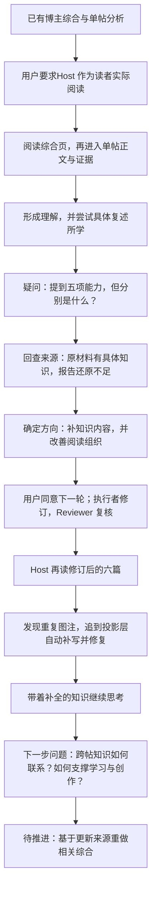
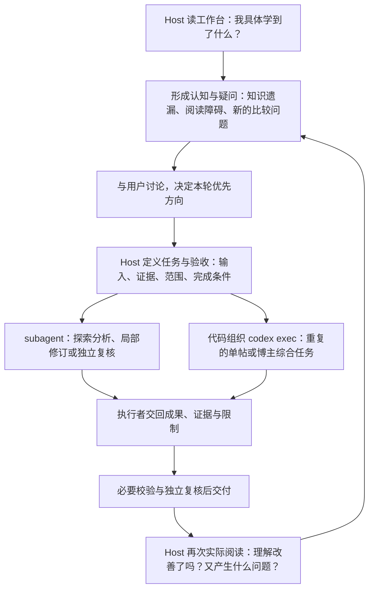

# 例子：Host 通过阅读博主研究工作台推动产品演进

## 场景

我们正在建设自媒体研究工作台。单帖详细分析与博主综合已经产出，用户希望借助它快速理解博主、学到具体知识，并为之后的模仿、规律提取和创作提供依据。此时，“分析已经生成”还不能回答“用户究竟能从中学到什么”。

用户要求 Host 亲自作为读者阅读：既读博主综合，也进入单帖，检查获得的认知、仍有的疑问，以及内容的摆放顺序。Host 因而需要带着实际理解任务使用产品，再决定后续工作。

## 实际发生的认知与行动

用户的提问：“作为用户读一下，获得了哪些认知？还有哪些疑问？认知的摆放是否合理？”

本例中，“知识还原不足”和“重复图注”是实际发现并修订的问题；最后的综合方向仍需推进，不能写成已经完成。

这组发问把注意力引向了**读完之后究竟理解了什么，以及由此还想追问什么**。它不只是要求换一个“用户”称谓，也不只是要求再做一次质量检查。

## 从这个场景提炼出的分工

下图是本次讨论形成的工作约定，不表示历史上每一步都通过两种执行方式运行过。

**Host 负责让认知推动产品演进。** 执行者可以深入研究并提出发现，但最终的使用体验、方向判断和与用户的讨论由 Host 承担。产品演进可能是补全知识、调整呈现、提出新的研究任务或试验创作方法；不等于持续增加功能。

`subagent` 适合当前会话中的灵活分工；`codex exec` 可以由代码组织为重复执行的服务。它们是执行方式，均可承担 Builder 或 Reviewer；执行服务负责队列、版本与恢复，Host 负责理解为何做、做什么，以及结果是否有用。

[有界会话取证与限制](../../../../docs/development/reader-question-trigger-2026-09-14.md) · [核心心智模型](mental-models.md)
