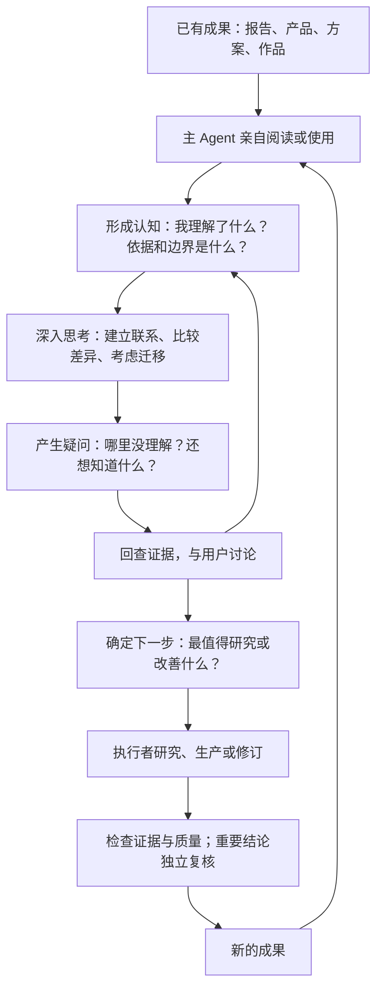
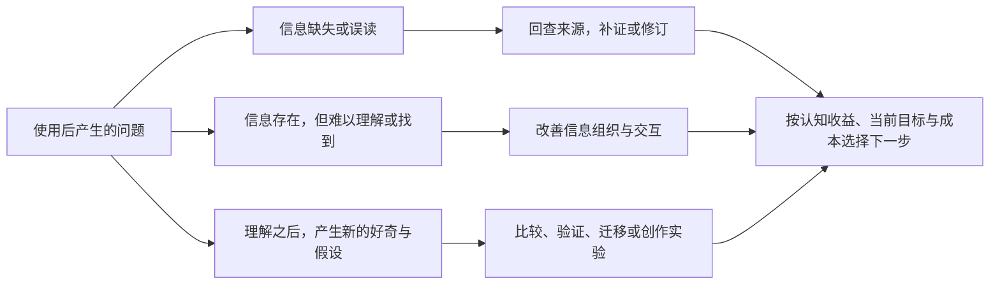

# 核心心智模型

**亲自使用成果 → 获得认知 → 深入思考 → 产生疑问 → 决定下一步 → 形成新成果。**

这是人与 AI 协作的工作模型：Host（主 Agent）需要实际阅读、操作和理解交付物，才能带着具体认识与用户讨论。这里不假设人和 AI 的内部认知机制相同。

疑问既可能暴露缺陷，也可能来自**已经学到的东西**，引出新的研究与创作方向。不能把这个循环缩成修 Bug 或检查报告是否齐全。

必要约定：

- **理解可以检验：** “讲了五项能力”只是描述；能说出五项分别是什么、条件是什么，才形成了具体认识。
- **困惑是线索：** 先核对已读范围与证据；工具未识别不等于材料不存在，来源无法回答时保留未知。
- **共同认知允许分歧：** 区分事实、来源主张、推断和未知；不把主 Agent 的判断写成用户已同意。
- **职责与工具分开：** Host 负责亲自理解、与用户讨论方向，并以认知推动产品演进；Builder 负责生产；Reviewer 负责可靠性。重复任务可由代码组织 `codex exec` 服务，探索可用 subagent；工具不能替代职责。
- **认识绑定来源：** 输入更新后，旧综合不自动有效。先在小闭环验证方法，再固化为 skill 或服务；不为每个疑问增加功能。
- **一轮可以结束：** 当前问题获得可用回答，或限制已经明确，就可结束；新疑问用于选择方向，不要求全部立即解决。

[这次交互的流程图](interaction-example.md) · [执行约定](../SKILL.md)
