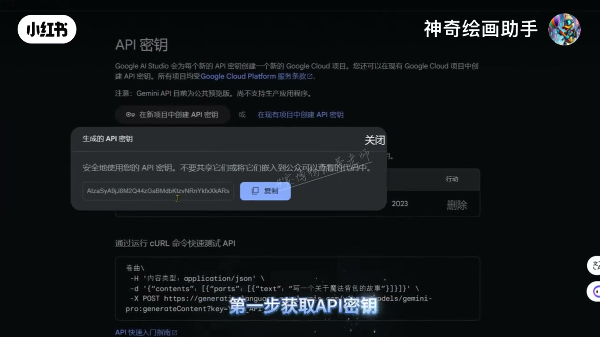
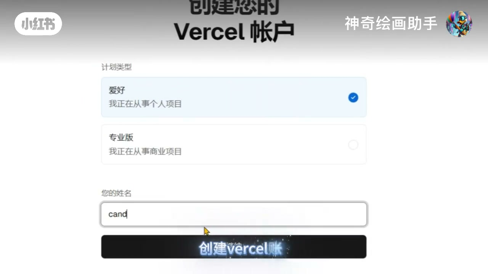
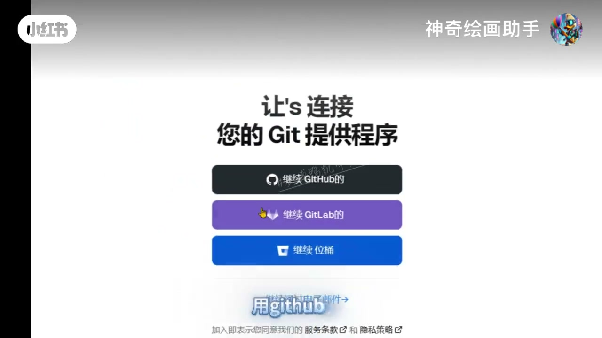
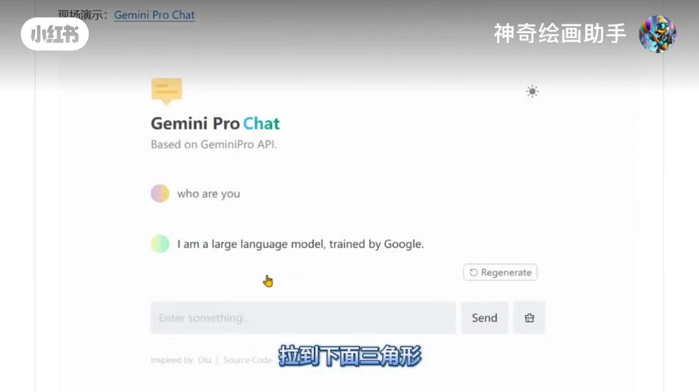
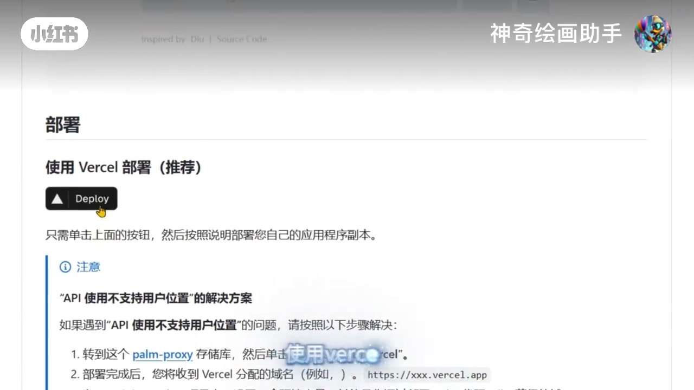
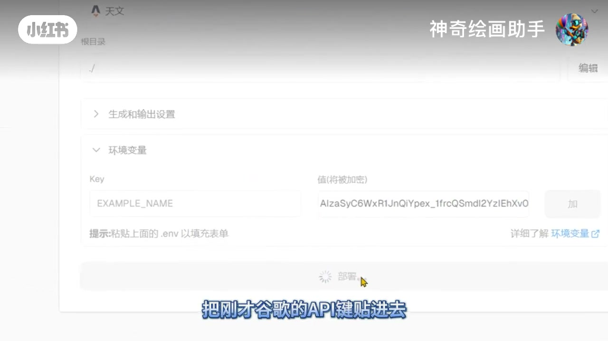
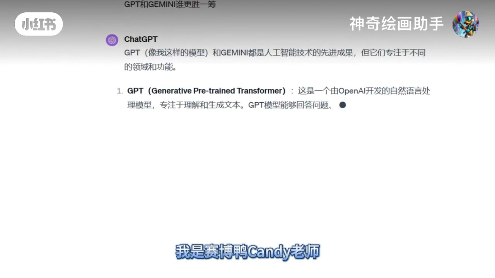

# 《1分钟本地部署 Gemini，免费使用 GPT4 模型》内容还原

> 样本：赛博鸭AIGC｜35.067 秒｜发布于 2023-12-27  
> 范围：只还原视频内部信息，不用帖子数据或外部知识替作者主张背书。官方字幕未取得，逐字稿来自 Whisper turbo；明显错词保留并单独解释。

## 一句话还原

视频用“免费、1分钟、小白可做、不再需要魔法和20美元”作为承诺，展示一条被快速剪辑压缩的部署路径：取得 Google AI Studio / Gemini API key，创建 Vercel 账户并连接 GitHub，在 Gemini Pro Chat 仓库 README 找到 Vercel Deploy，填写环境变量，看到 Vercel 成功页，再展示一个能输出文本的 Gemini Pro Chat 网页。

但视频真正可见的产品身份是 **Gemini Pro Chat / Based on GeminiPro API**，不是 GPT-4 后端证明。画面还在部署步骤之前先出现了已运行的 Gemini Pro Chat 演示页，并在 README 中短暂显示“API 使用不支持用户位置”的解决方案。因此，“免费使用 GPT4”“一分钟完成”“不再需要魔法”都只能记作作者主张，不能记作视频已经证明的事实。

## 观众看完后实际能知道什么

可以知道：

- 这套演示把 Google AI Studio、Google Cloud、Vercel、GitHub、一个 Gemini Pro Chat 仓库和最终聊天网页串成了一条部署叙事。
- Google AI Studio 的 API key 页面确实被展示，页面同时写明 Gemini API 当时处于公共预览、尚不支持生产应用。
- 仓库 README 确实有“使用 Vercel 部署（推荐）”和 Deploy 按钮。
- Vercel 页面确实显示环境变量输入区、部署成功庆祝页，以及项目名 Gemini Pro Chat。
- 结果页确实显示了生成文本，包括“鲁迅和周树人谁更有哲学”和“GPT和GEMINI谁更胜一筹”的回答。

不能据此知道：

- 最终网页是否调用 GPT-4；画面反而更直接指向 GeminiPro API。
- 免费额度、调用成本、Vercel 成本、地区、账号资格和长期可用性。
- 真实环境变量键名。视频可见的 Key 是占位式 `EXAMPLE_NAME`。
- 复制、授权、fork/import、真实变量配置、提交、构建日志和打开最终 URL 是否按同一次连续操作完成。
- 评论区拿到的作者部署版本如何交付、谁维护、是否安全、能用多久。

## 视频恢复出的完整依赖链

1. **准备 API key**（06.40–12.50）  
   页面标题是“API 密钥”，正文写明 Google AI Studio 会为新 API key 创建 Google Cloud 项目，项目受 Google Cloud Platform 服务条款约束。页面还显示：Gemini API 当时为公共预览，尚不支持生产应用。弹窗出现“生成的 API 密钥”、长字符串和“复制”按钮；视频没有证明复制动作真的执行。

   

2. **创建 Vercel 账户**（12.50–14.42）  
   画面显示 Vercel 账户页，可选个人项目或商业项目，并出现姓名输入框。

   

3. **连接 Git 提供程序**（14.42–15.70）  
   作者口播“用 Github 登录”。页面列出 GitHub、GitLab 和 Bitbucket 入口，但授权范围、回调过程和已有登录态没有展示。

   

4. **进入代码仓库并向下找部署入口**（15.70–18.78）  
   仓库文件列表可见 README、Dockerfile、package.json 等文件。值得注意的是，在真正显示 Deploy 入口前，视频先剪入一个已经运行的 Gemini Pro Chat 演示页，页面写着“Based on GeminiPro API”，并回答自己是由 Google 训练的大语言模型。这说明视频的编辑顺序不是一段连续部署录像。

   

5. **从 README 使用 Vercel 部署**（17.80–18.78）  
   README 显示“部署”“使用 Vercel 部署（推荐）”和 Deploy 按钮，并称点击后按说明部署自己的应用副本。其下方还出现“API 使用不支持用户位置”的解决方案，提到 `palm-proxy` 仓库以及部署后获得 Vercel 域名。这是对开头“不要魔法”的重要限制条件；精确代理操作因小字只部分可读。

   

6. **填写 Vercel 环境变量**（18.78–22.68）  
   画面显示 Key、值和 `.env` 填充提示。Key 一栏可见为 `EXAMPLE_NAME`，值栏是一段长字符串。烧录字幕说“把刚才谷歌的API键贴进去”，但视频没有展示真实变量键名，也没有连续证明复制、粘贴和提交。

   

7. **等待并看到成功页**（22.83–25.24）  
   页面写着“祝贺！您刚刚将一个新项目部署到 Vercel。”，项目结果标注 Gemini Pro Chat。成功页能证明视频展示了一个成功状态，不能反向补齐此前缺少的操作。

   

8. **展示聊天结果**（25.24–34.42）  
   作者在这里声称“这样就可以免费使用 GPT4 了”。但前后的可见产品身份仍是 Gemini Pro Chat / GeminiPro API。视频显示了文本生成结果，却没有显示 GPT-4 模型选择、后端请求、账单或额度。

   

9. **把操作摩擦转成评论区 CTA**（26.84–30.62）  
   如果观众仍觉得麻烦，作者让其在评论区留言，并承诺把自己部署好的版本发给大家。交付方式、访问权限、隐私、安全、维护和支持责任没有说明。

10. **身份与口号收尾**（30.62–35.067）  
    烧录字幕显示“我是赛博鸭Candy老师”“在AI星际中一路为您引航”。机器转写在这里出现明显错词，但结尾意义很清楚：把一次工具教程收束为“持续提供 AI 导航”的账号价值承诺。

## 作者主张、可见证据和未知边界

| 作者主张 | 视频确实展示 | 视频没有建立 |
|---|---|---|
| 一分钟、小白也能部署 | 35秒内快速剪过多个页面 | 新用户真实操作耗时、登录授权和构建耗时 |
| 不要魔法和20美元 | Google/Vercel/GitHub 路径 | “魔法”含义、地区/网络条件、完整成本；README 反而显示用户位置问题 |
| API key 对大众开放 | Google AI Studio API key 页和生成密钥弹窗 | 账户资格、地区、配额、计费、当前有效性 |
| 免费使用 GPT4 | Vercel 成功页和可输出文本的聊天页 | 后端 GPT-4、免费额度、长期可用性；可见身份是 Gemini Pro Chat / GeminiPro API |
| 评论可获作者部署版本 | 评论区留言和发送承诺 | 交付渠道、权限、安全、维护、支持责任 |

## 编辑顺序与操作依赖不是一回事

视频的屏幕顺序是：API key → Vercel 账户 → Git 连接 → 仓库列表 → **已经运行的 Gemini Pro Chat** → README Deploy → 环境变量 → 成功页 → 聊天回答。

如果按依赖关系理解，则应是：先准备 API key 和账户，再从仓库触发部署，配置环境变量，完成构建，最后打开结果页。视频把结果页提前插入，是为了让观众先看见“这东西能用”，但也因此不能把整段当成一镜到底的操作证据。

明确缺失的桥接动作包括：

- API key 的真实复制动作；
- GitHub 点击、授权范围与回调；
- 仓库 fork/import 和精确仓库/commit；
- Deploy 跳转中的项目导入步骤；
- 真实环境变量键名；
- 粘贴与提交动作；
- 构建日志、错误、重试与完成耗时；
- 打开最终项目 URL 的动作。

## 机器逐字稿与烧录字幕冲突

| 时间 | 机器逐字稿（原样保留） | 画面支持的读法 | 处理 |
|---|---|---|---|
| 17.02–18.78 | “三角形使用Vercel部署” | 运行页烧录“拉到下面三角形”，随后 README 显示“使用 Vercel 部署（推荐）” | 只能恢复“下拉找到 Deploy 入口”的操作意图，精确旁白仍不确定 |
| 20.04–21.88 | “把刚才谷歌的API捡贴进去” | 烧录字幕“把刚才谷歌的API键贴进去” | 恢复输入 API key 的意图，不声称粘贴已执行 |
| 30.62–32.02 | “我是塞伯亚Candy老师” | “我是赛博鸭Candy老师” | 画面读法作为支持解释，原机器文本保留在逐字稿层 |
| 32.02–34.58 | “在AI星级中一路为您银行” | “在AI星际中一路为您引航” | 画面读法用于解释结尾意义，原机器文本保留 |

## 完整机器逐字稿

| 时间 | 原文 |
|---|---|
| 00:00.000–00:01.700 | 教会你如何白嫖GPT4模型 |
| 00:01.700–00:02.880 | 本地部署Gemini |
| 00:02.880–00:03.600 | 别怕难 |
| 00:03.600–00:05.120 | 一分钟的事小白也可以 |
| 00:05.120–00:06.860 | 再也不要魔法和二十美刀了 |
| 00:07.400–00:08.640 | 第一步获取API密钥 |
| 00:08.640–00:11.500 | 这里谷歌的双子星模型密钥是对大众开放的 |
| 00:11.500–00:12.020 | 直接拿 |
| 00:12.500–00:14.080 | 第二步创建Vercel账户 |
| 00:14.420–00:15.320 | 用Github登录 |
| 00:15.700–00:17.020 | 在这个网页上拉到下面 |
| 00:17.020–00:18.780 | 三角形使用Vercel部署 |
| 00:18.780–00:20.040 | 跳转过来环境变量 |
| 00:20.040–00:21.880 | 把刚才谷歌的API捡贴进去 |
| 00:22.340–00:23.140 | 等待一会儿 |
| 00:23.140–00:24.240 | 会部署成功了 |
| 00:24.240–00:26.340 | 这样就可以免费使用GPT4了 |
| 00:26.840–00:28.600 | 如果还嫌麻烦那可以评论区留言 |
| 00:28.600–00:30.620 | 我把我部署好的发给兄弟们吧 |
| 00:30.620–00:32.020 | 我是塞伯亚Candy老师 |
| 00:32.020–00:34.580 | 在AI星级中一路为您银行 |

每个 cue 的代表帧和全部 overlapping shots 已保存在 `reconstruction.json → transcript.cues`，每个 cue 的知识/语境/不确定处置已保存在 `coverageMatrix.cueAccountability`。

## 非语音音频

混合音轨的四个无缝 10 秒窗口都把 Music 列为高分候选，同时包含 Speech；最后一个窗口还提出相机/音效类候选。可以确认音乐性背景持续承担快节奏、科技感和推进作用；不能确认曲目、许可、来源，也不能把机器候选直接当成某个具体结尾音效。

## 最终边界

这条视频最可靠的知识不是“免费 GPT-4 已经被部署”，而是：作者展示了一个以 Google AI Studio API key、Vercel、GitHub 和 Gemini Pro Chat 仓库为核心的快速部署叙事，并用成功页和文本回答降低观众的操作恐惧；与此同时，它省略了决定能否真实复现的多个桥接动作和服务条件。

本还原已经检查语音、机器逐字稿、烧录字幕、UI、文档、光标/滚动、参数/输出、剪辑顺序、品牌、水印、布局、全时间线缺失项和非语音音频。剩余问题均被明确列为未知，而不是用常识补齐。
