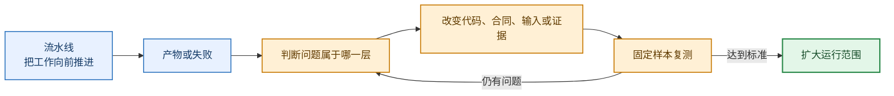
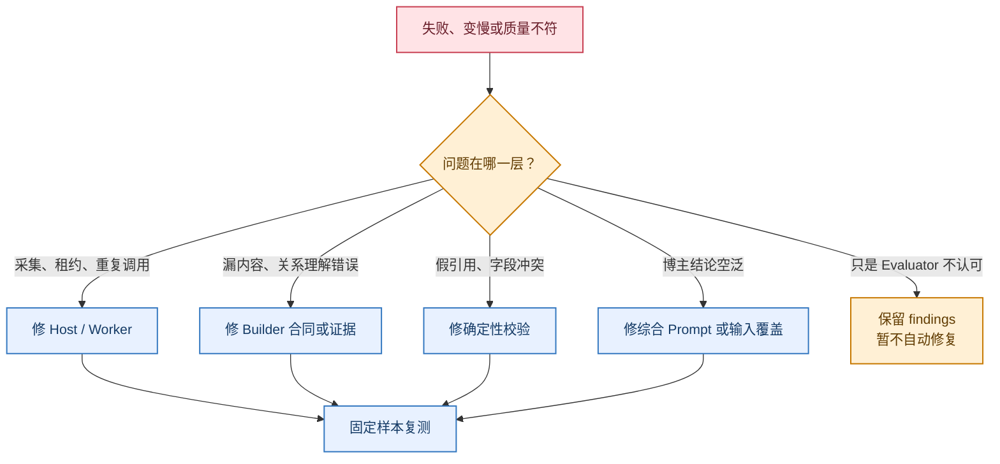
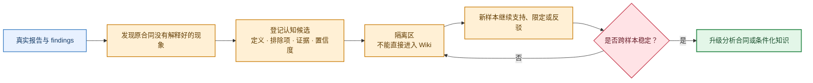

# 单博主与多博主 Agent Loop

状态：**目标运行合同；当前实现是否达到合同，以代码、测试和真实运行记录为准**  
更新日期：2026-09-02

## 一句话

单博主 Loop 负责把“这个人发过什么”变成一份有证据的博主结论；多博主 Loop 负责让多个
单博主任务互不拖累地完成，再比较它们共同的规律、成立条件和例外。

Agent Loop 不是让模型失败后原样重试。一次有效循环必须产生新的观察、明确问题属于哪一层，
并且只在输入、代码、合同或证据发生变化后重新运行。

## 流水线和循环不是一回事

如果输入、代码、合同和证据都没有变化，重复执行不叫 Loop，只叫重复消耗。

## 两种循环

### 生产 Loop

这是日常跑数据的循环。它只做已有能力已经定义好的工作：领取任务、生成 Artifact、检查、登记状态、
从断点继续。生产 Loop 不允许模型临时修改自己的 Prompt、Skill、Schema 或质量标准。

### 优化 Loop

这是开发系统时使用的循环。出现明显变慢、连续失败、结果不可读或质量争议时，保留少量代表性会话，
使用 `session-forensics` 对照“Agent 的解释”和“实际工具调用、耗时、失败与产物”。观察者只指出裂缝，
由 Host/开发者决定修改哪一层，再用同一批样本复测。

`session-forensics` 不全量挂在每个任务上。至少为每个模型、Prompt、Skill 合同版本保留一个可复盘样本；
其他任务只保留结构化运行收据、耗时和失败分类。

## 单博主 Agent Loop

### 最终要得到什么

一个博主完成后，不是只留下 12 份视频报告，而是得到：

- 全部可见帖子的表层作品地图；
- 代表性帖子的深度证据；
- 一份回答“他是谁、服务谁、为什么被关注、什么内容有效、边界是什么”的博主结论；
- 一个能回到原帖、视频、字幕、画面和版本的博主档案页面。

### 主流程

“12 条”是四个表现组各 3 个样本成员，不保证一定是 12 个不同帖子；重叠帖子只深度处理一次。
全部帖子做可观察的表层分析，代表视频才做昂贵的深度重建。

### 四个角色

| 角色 | 负责 | 不负责 |
| --- | --- | --- |
| Host | 固定输入版本、调度、恢复、机械组装、状态与停止决定 | 发明视频含义或替 Evaluator 判断质量 |
| Builder | 理解帖子和视频，写出知识单元、关系、证据与未知 | 转写重试、路径修补、伪造缺失证据 |
| Evaluator（可选） | 独立检查候选是否可进入正式知识 | 修改候选、自动修复、删除可用 Builder 结果 |
| Forensics Observer（按需） | 审计慢、重复、漂移和假通过 | 参与正常生产、直接解决业务问题 |

### 两个完成级别

**博主档案可用**：全部帖子覆盖和缺失范围明确；代表样本均有可用 Builder 结果或明确阻塞；博主整体
分析通过确定性检查；页面能展示证据、暂定结论和未知。Evaluator 可以跳过。

**正式知识可用**：在博主档案可用的基础上，独立 Evaluator 绑定当前候选版本并通过正式知识闸。
只有这个级别可以把结论晋升为正式 Wiki 知识。

Evaluator 发现问题时，保留博主档案和 findings，不自动修复。是否修复由 Host 根据问题价值、影响范围
和成本单独决定。

### 单博主完整报告说什么

| 部分 | 回答的问题 |
| --- | --- |
| 博主身份 | 他是谁、服务谁、解决什么问题、靠什么建立信任、可能怎样商业化 |
| 作品地图 | 全部可见内容一帖一行：主题、问题、承诺、价值、标题结构，以及证明/画面/正文的未知 |
| 内容系统 | 主题组合、常用结构、视觉语言、反复出现的内容角色 |
| 表现分层 | High / Base / Low 各有什么特征；只讲相关性，不冒充因果 |
| 逐帖结论 | 规范 21 条逐条说明内容角色、形式、表现解释、证据和未知 |
| 深度证据 | 代表视频的 Builder 报告、Evaluator findings、版本和证据引用 |
| 当前边界 | 哪些是观察、作者自述、推断、未知；哪些还只是 provisional |
| 新认知候选 | 本轮发现了哪些原合同没覆盖的维度，证据是什么，下一轮如何验证 |

报告不是博主介绍文，也不是“抄什么”的建议清单。它必须让读者知道每个结论从哪来、成熟到什么程度。

### 出问题时怎么循环

同一 revision 不能无限重试。每次重跑必须记录新的输入/代码/合同指纹和上一次失败分类；没有新变化时
停止并展示 blocker。开发阶段可以继续迭代，但每轮必须只验证一个明确假设。

## 多博主 Agent Loop

多博主 Loop 不重新发明单博主分析。它创建一批相互隔离的单博主 Run，复用同一套单博主合同，
最后只对已经固定版本的博主档案做比较。

```mermaid
flowchart TB
    I["输入 1–20 个博主"] --> BH["Batch Host<br/>去重 · 固定顺序 · 创建成员 Run"]
    BH --> M1["单博主 Loop A"]
    BH --> M2["单博主 Loop B"]
    BH --> MN["单博主 Loop N"]
    M1 --> Q["可比性检查<br/>时间 · 平台 · 样本 · 指标 · 深度覆盖"]
    M2 --> Q
    MN --> Q
    Q --> CB["Comparison Builder<br/>共同规律 · 条件 · 反例"]
    CB --> CD["多博主比较结果"]
    CD -.正式知识.-> CE["可选独立评估"]
    CE --> WK["跨博主 Wiki 候选"]

    classDef host fill:#DCE7FF,stroke:#284B9B,color:#102B5C,stroke-width:1.5px;
    classDef member fill:#E6F7FB,stroke:#1687A7,color:#164B59,stroke-width:1.5px;
    classDef gate fill:#FFF0D5,stroke:#C77800,color:#603B00,stroke-width:1.5px;
    classDef result fill:#E3F6E8,stroke:#2C8A4B,color:#174D2A,stroke-width:2px;
    class BH host;
    class M1,M2,MN,CB member;
    class Q,CE gate;
    class I,CD,WK result;
```

### 多博主循环的规则

- 一个博主失败、退避或等待用户，不得阻塞其他博主；批次可以是“部分完成”。
- 已完成的帖子、视频和博主 Artifact 不因批次重试而重跑。
- 比较必须绑定每个博主的固定 Run 和 revision，不能读取“最新文件”后静默漂移。
- 平台、时间窗口、作品数量、指标口径或深度覆盖不可比时，明确写“不适合直接比较”。
- 共同出现不等于因果。跨博主结论必须同时记录支持者、反例、成立条件和未知。
- 多博主结果用于理解内容生态；要转成“我们应该做什么”，必须进入独立的内容策略工作台。

### 多博主完整报告说什么

| 部分 | 回答的问题 |
| --- | --- |
| 可比性 | 平台、时间窗、样本量、公开指标和深度覆盖是否能直接比较 |
| 定位对照 | 各博主的受众、问题、价值、信任来源和商业路径有何异同 |
| 账号内分层 | 每个博主自己的 High / Base / Low 如何变化，不用绝对点赞粗暴横比 |
| 共同机制 | 哪些结构或内容角色在多个已验证博主中重复出现 |
| 成立条件 | 共同机制在什么主题、形式、受众或阶段下成立 |
| 例外与反例 | 谁没有出现、何时失效、哪些结果与暂定规律相反 |
| 证据缺口 | 当前还缺哪些博主、帖子、视频内部证据或后台指标 |
| 认知台账 | 候选规律的支持、限定、反驳、隔离与晋升状态 |

## 认知 Loop：在执行中发现“还应该分析什么”

认知候选复用现有 Research Learning 数据模型，不另建一套笔记。一次发现只创建候选观察；只有跨博主、
跨档位或 holdout 样本继续支持，且反例和适用条件都清楚后，才考虑修改 Skill/Schema 或晋升 Wiki。

### 放量顺序

先完成 1 个黄金博主，证明单博主闭环；再完成 2 个真实博主，证明失败隔离、成本和比较；随后扩大到
5 个检查可比性与结论价值；最后才允许 20 个批量运行。每一级都复用已有 Artifact，不从头重做。

### V1 真实运行得到的新认知

这两条不是预先设计出来的字段，而是从真实报告失败中发现的候选：

1. **先验证视觉连续性，再声明新载体。** 清华姜学长的 High 样本把 105–109 秒连续讲述者画面误判成
   插入卡片，随后同时污染内容还原、编导和剪辑判断。这个候选已进入隔离台账；当前只保留 finding，
   不自动修 Builder。
2. **跨博主模式前需要可审计的语义角色归一化。** AI红发魔女与秋芝2046各有 21 个自然语言
   `contentRole`，精确字符串比较得到 0 个共同模式和 42 个“特例”。V1.1 只展示每人 3 个代表例并把
   语义聚类列为未知。以后即使加入聚类，也必须保留原描述、支持样本、反例和人工可读边界，不能凭模糊
   相似度直接晋升共同机制。
3. **“采集到”不等于“完成作品地图”。** 清华姜学长已有 201 条清单和可复现点赞统计，但旧投影只让
   21 条对照记录进入结构化内容层。现在新增不可变 `portfolio-annotations`：201 个作品 ID 必须恰好对应
   201 行，证据不足的 49 条允许整体未归类；某一字段证据不足则明确写未知。21 条仍只负责对照，12 条
   仍只负责深度解释。这个区分是单博主报告质量的前置条件，不是多展示一张表。

第一个候选来自单视频质量 Loop，第二个来自多博主认知 Loop，第三个来自单博主验收。它们共同证明
认知台账应独立于正式报告，否则一次错误、一次漂亮的归类或一个被误读的完成数字都会直接改变生产合同。

## 一次循环必须留下什么

每次生产或优化循环都至少留下：

1. 固定的输入与 Artifact revision；
2. 当前代码、Prompt、Skill 和 Schema 指纹；
3. 各阶段开始、结束、耗时和模型角色；
4. 失败分类、failed gate 和未知；
5. 本轮改变了什么；
6. 固定样本的前后对比；
7. `继续 / 扩大 / 保留 findings / 阻塞 / 停止` 决定。

## Skill 应该怎么放

- `analyze-creator-videos`：单博主生产 Loop 的入口和路由器；
- `video-content-reconstruction`：单视频 Builder / 可选 Evaluator；
- `creator-research-synthesis`：把全部帖子与深度证据合成博主结论；
- `compare-creators`：多博主可比性检查和跨博主结论；
- `session-forensics`：只在优化 Loop 中审计代表性会话；
- `content-strategy-workbench`：把研究结果转成我们自己的创作决策。

现在不新建 `creator-research-agent-loop` Skill。先让上述合同在一个黄金博主、两个真实博主和一个小批次
里经过前向验证；只有当同样的编排缺口跨运行复发，且出现稳定可复用的操作序列时，再将其提升为独立 Skill。
