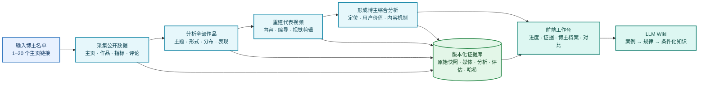
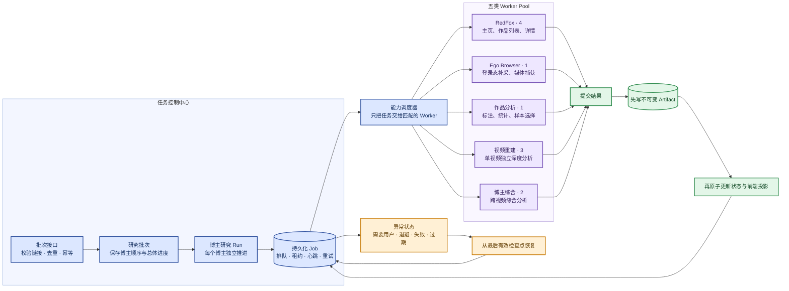
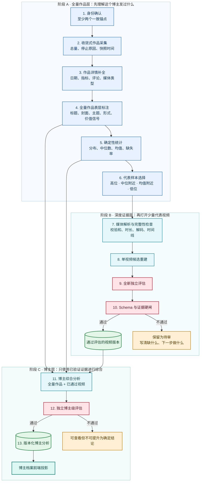
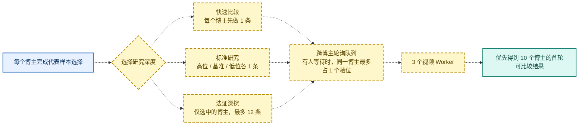

# 博主研究与视频重建架构

状态：**当前架构说明 + 明确标注的目标改造**  
更新日期：2026-08-31

第一次阅读请先看更短的[核心心智模型](../vision/signal-room-core-mental-model.md)；本文只负责展开工程执行、Worker、Skill 与证据硬闸。

这份文档回答五个问题：

1. 输入一批博主后，系统最终产出什么？
2. 任务为什么可以暂停、重试和恢复？
3. 一个博主从公开主页到综合分析，要经过哪些步骤？
4. 一条本地视频为什么需要几十分钟？
5. 每个 Skill 在流水线中负责什么？

为了保证可读性，本文不把所有模块和连线塞进一张“巨型总图”。先用一张图看懂产品，
再分别展开任务调度、博主研究、单视频重建和 Skill 分工。

## 一、一眼看懂整个产品

这条主链路的核心不是“生成一份报告”，而是：

> 把公开内容变成可回到原始证据、可独立检查、可跨博主比较、可继续积累的知识资产。

## 二、任务如何被执行和恢复

这张图只说明工程执行，不讨论研究结论。

### 为什么要分成五个池子

采集、浏览器、作品统计、视频重建和博主综合的资源完全不同。分池以后：

- 视频重建很慢，不会阻止下一个博主开始采集；
- 某个博主需要登录，不会让其他博主一起阻塞；
- 每个池子可以单独限制并发，避免付费接口或本机浏览器失控；
- Worker 中途退出后，租约过期，任务可以从持久化状态恢复。

## 三、一个博主的完整研究流程

这里有一个非常重要的边界：

- **全量作品层**覆盖博主的全部可见作品，但只做表层、可观察的标注；
- **深度证据层**只选择少量代表视频，打开视频内部，分析真正讲了什么、怎么讲、怎么剪；
- 表层信息不能冒充视频内部知识，未通过独立评估的视频不能支撑博主级机制结论。

## 四、一条本地视频内部到底做了什么

```mermaid
flowchart TB
    SOURCE["本地视频<br/>来源、帖子身份、SHA-256、时长"]

    subgraph CANDIDATE["进程 1 · 候选重建进程"]
        direction LR
        V1["媒体探测<br/>容器、音视频流、解码健康"]
        V2["转写与音频检查<br/>语音、静音、转写质量"]
        V3["第一轮全时间线探测<br/>关键帧、字幕、UI、演示动作"]
        V4["制定视频专属捕获方案<br/>找出未知问题与重点时间段"]
        V5["第二轮定向证据捕获<br/>密集抽帧、OCR、UI 状态"]
        V6["三镜头重建<br/>内容还原 · 编导逻辑 · 视觉剪辑"]
        V7[("候选产物<br/>结构化 JSON · 中文报告 · 运行记录")]
        V1 --> V2 --> V3 --> V4 --> V5 --> V6 --> V7
    end

    subgraph EVALUATOR["进程 2 · 全新独立评估进程"]
        direction LR
        E1["重新打开原视频<br/>重新检查允许使用的证据"]
        E2["内容还原 · 6 项检查"]
        E3["编导逻辑 · 6 项检查"]
        E4["视觉剪辑 · 7 项检查"]
        E5[("独立评估结果")]
        E1 --> E2 --> E3 --> E4 --> E5
    end

    subgraph GATE["确定性校验与发布"]
        direction LR
        G1["绑定候选与评估哈希"]
        G2["Schema 校验<br/>字段、枚举、引用关系"]
        G3["证据硬闸<br/>覆盖率、召回率、时间戳、未知纪律"]
        G4{"最终状态"}
        G1 --> G2 --> G3 --> G4
    end

    SOURCE --> V1
    V7 --> E1
    SOURCE --> E1
    V7 --> G1
    E5 --> G1
    G4 -->|"全部通过"| READY[("写入版本化视频 Artifact")]
    G4 -->|"未通过"| NOTREADY["not_ready / blocked<br/>不提升为确定知识"]

    classDef source fill:#E8F1FF,stroke:#3478C0,color:#153B66,stroke-width:2px;
    classDef candidate fill:#E6F7FB,stroke:#1687A7,color:#164B59,stroke-width:1.5px;
    classDef evaluation fill:#FFE3E6,stroke:#C83F52,color:#681D29,stroke-width:1.5px;
    classDef validation fill:#FFF0D5,stroke:#C77800,color:#603B00,stroke-width:1.5px;
    classDef evidence fill:#E3F6E8,stroke:#2C8A4B,color:#174D2A,stroke-width:2px;
    classDef warning fill:#F2F3F5,stroke:#747B85,color:#343A40,stroke-width:1.5px;

    class SOURCE source;
    class V1,V2,V3,V4,V5,V6,V7 candidate;
    class E1,E2,E3,E4,E5 evaluation;
    class G1,G2,G3,G4 validation;
    class READY evidence;
    class NOTREADY warning;

    style CANDIDATE fill:#F5FCFD,stroke:#8FC7D4,stroke-width:1px
    style EVALUATOR fill:#FFF7F8,stroke:#D99AA3,stroke-width:1px
    style GATE fill:#FFFBF2,stroke:#E2B86C,stroke-width:1px
```

### 为什么 90 条视频会很慢

一条视频不是一次普通 LLM 请求，而是两次相互隔离的深度进程：

1. 候选进程先完整探测，再根据视频内容决定第二轮去哪里补证据；
2. 独立评估进程不能相信候选结论，必须重新检查原视频和证据；
3. 最后还有不能被模型绕过的确定性硬闸。

当前只有 3 个视频 Worker。90 条视频大约需要 30 轮；如果每轮需要 40–55 分钟，总耗时就
会接近一天。问题不是单个步骤“卡死”，而是把法证级深度默认应用到了全部 90 条视频。

## 五、目标调度：先让 10 个博主都产生可比较结果

下面是**目标架构，尚未实现**。黄色虚线表示目标变化。

目标调度不会降低单条视频的证据标准，只改变“先分析哪几条”：

| 模式 | 适用场景 | 首轮数量 |
| --- | --- | ---: |
| 快速比较 | 尽快看见每个博主的一个可信样本 | 每个博主 1 条 |
| 标准研究 | 建立高位、基准、低位的内容差异 | 每个博主 3 条 |
| 法证深挖 | 已经找到值得深入研究的博主或机制 | 选中博主最多 12 条 |

## 六、Skill 在哪里发挥作用

Skill 定义“应该检查什么、什么证据才算够”；Worker 负责真正执行。Skill 不是 Worker，
也不是最终 Artifact。

```mermaid
flowchart LR
    S0["analyze-creator-videos<br/>总编排与闭环检查"]
    S1["xiaohongshu-creator-acquisition<br/>身份、作品、详情、媒体"]
    S2["creator-portfolio-annotation<br/>全量作品表层标注"]
    S3["creator-sample-selection<br/>代表样本确定性选择"]
    S4["video-content-reconstruction<br/>单视频自适应证据重建"]
    S5["creator-research-evaluator<br/>视频级与博主级独立评估"]
    S6["creator-research-synthesis<br/>博主级综合分析"]

    S0 --> S1 --> S2 --> S3 --> S4 --> S5 --> S6

    classDef orchestrator fill:#DCE7FF,stroke:#284B9B,color:#102B5C,stroke-width:2px;
    classDef skill fill:#FFF0D5,stroke:#C77800,color:#603B00,stroke-width:1.5px;
    classDef gate fill:#FFE3E6,stroke:#C83F52,color:#681D29,stroke-width:2px;

    class S0 orchestrator;
    class S1,S2,S3,S4,S6 skill;
    class S5 gate;
```

| Skill | 输入 | 主要输出 | 明确禁止 |
| --- | --- | --- | --- |
| `analyze-creator-videos` | 研究请求 | 研究合同、阶段编排、闭环状态 | 把一次 CLI 成功当成研究完成 |
| `xiaohongshu-creator-acquisition` | 公开主页和帖子 | 身份、库存、详情、媒体清单 | 从标题封面推断视频内部机制 |
| `creator-portfolio-annotation` | 全量作品表层信息 | 每帖主题、形式、价值信号 | 把表层标注升级成深层事实 |
| `creator-sample-selection` | 固定语料版本与统计 | 可复现的高位/基准/低位样本 | 凭感觉挑“看起来不错”的帖子 |
| `video-content-reconstruction` | 原视频和证据 | 内容、编导、视觉剪辑重建 | 用无时间戳的概述代替证据 |
| `creator-research-evaluator` | 原视频、证据、候选分析 | 独立评估和硬闸结论 | 复用候选进程的隐藏上下文 |
| `creator-research-synthesis` | 全量语料和通过的视频 | 博主定位、价值、内容机制 | 输出模仿或抄袭策略 |

## 七、前端应该展示什么

前端只读取后端投影，不直接读取本地文件，也不在 React 组件里推断研究结论。

| 页面 | 应该回答的问题 |
| --- | --- |
| 批次工作台 | 10 个博主分别进行到哪里？哪个 Worker 正在忙？为什么等待？ |
| 博主档案 | 这个博主的定位、用户价值、内容结构和证据是什么？ |
| 视频详情 | 当前处于媒体探测、候选重建、独立评估还是硬闸？ |
| 证据检查器 | 某个结论对应哪条视频、哪个时间戳、哪张截图？ |
| 跨博主比较 | 哪些是普遍规律，哪些只属于某个博主，适用条件是什么？ |
| LLM Wiki | 哪些案例已经重复出现，足以提升为条件化知识？ |

前端必须同时展示两条状态：

- **任务状态**：排队、运行、需要用户、退避、成功、失败；
- **研究状态**：部分可用、可审核、已通过、未通过、已有旧版本但已过期。

因此，“任务执行成功但研究结果仍需审核”是合法状态，不能被前端错误显示为全部完成。

## 八、颜色约定

| 颜色 | 固定含义 |
| --- | --- |
| 蓝色 | 输入、批次、Run、Job、调度等控制信息 |
| 紫色 | 负责执行任务的 Worker Pool |
| 青色 | 研究和内容处理步骤 |
| 红色 | 独立评估与不可绕过的证据硬闸 |
| 绿色 | 不可变、版本化的证据与 Artifact |
| 青绿色 | 前端投影和最终知识产品 |
| 黄色 | 异常处理，或明确标为尚未实现的目标架构 |

## 九、相关架构合同

- [博主研究控制面 ADR](../adr/0002-creator-research-control-plane.md)
- [能力分池批次 ADR](../adr/0008-capability-partitioned-creator-research-batches.md)
- [运行时 Skill 流水线](../initiatives/active/creator-analysis-os-v1/runtime-skill-pipeline.md)
- [任务、工作流与证据闸门](../initiatives/active/creator-analysis-os-v1/pipeline-and-gates.md)
- [三镜头视频分析合同](../initiatives/active/creator-analysis-os-v1/three-lens-video-contract.md)
- [Creator Batch Pipeline V2](../initiatives/active/creator-batch-pipeline-v2/README.md)
