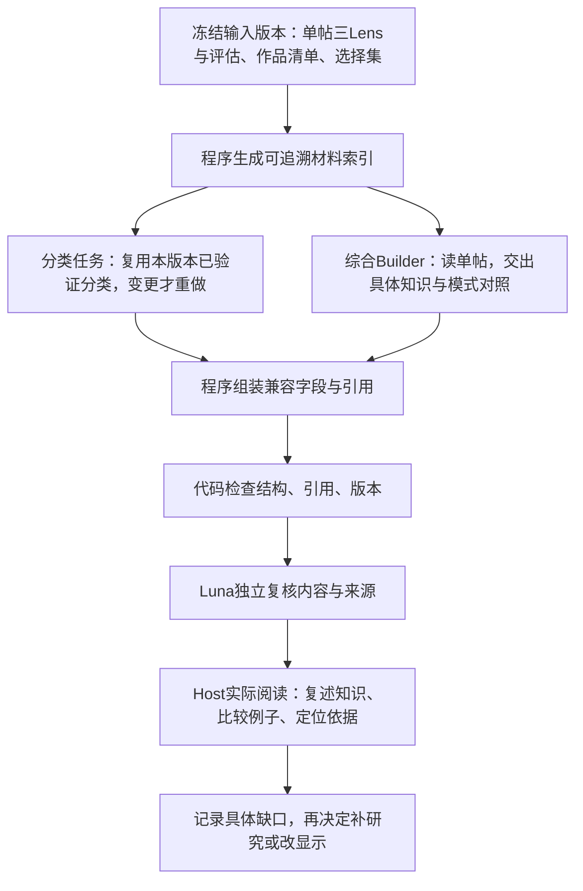

# 综合执行流程：本轮审计后的试跑方案

状态：同题试跑、定向修订及独立复核已完成；最终综合为reviewable，6/7通过。Host已实际阅读并核对关键单帖，流程及展示改动通过相关检查。9篇单帖仍有评估问题，不是全部研究ready。下文保留各轮当时状态与执行证据。

## 已核对的承重边界

- 执行器当前同一调用承担全清单分类、21条兼容记录和深度综合；首版候选中分类文本占约68.1%，跨帖研究约9.2%（按JSON序列化字符计，不是token或耗时）。不能据此断言模型上下文溢出或没有读完。
- 代码校验可以证明必需部分存在、ID覆盖和引用绑定；它不能证明读者获得了具体知识。不能靠增加最少字数、finding数量或阅读命令次数代替认知验收。
- 原始CLI事件未被执行器持久保存；临时会话不保留rollout。过去缺失的逐步行为不能通过后来补日志恢复。

## 下一次只重做本博主综合

1. **材料准备由代码承担。** 提供每篇完整builderLenses、评估边界及稳定原字段引用，降低查找路径和重复序列化负担。减少的是无关包装与重复输入，最低保留范围是三Lens全部字段、连续内容块、对应证据和质量问题；不得仅给摘要。
2. **分离交付责任。** 分类与综合绑定相同输入版本，但不让196行分类登记成为综合正文生产的主要输出。已有分类可复用，不能为了拆分流程把每次成本翻倍。兼容行中只有确定性可投影字段由代码填，研究判断仍来自已登记Builder；没有事实源就明确缺失。
3. **具体研究中间结果可审阅。** 综合先交关键问题及支持/例外样本的对应关系；可以使用已有finding/support结构形成候选，不强加固定条数或另造重复单帖报告。内容应允许读者复述具体机制/步骤/条件，并看出不同表达模式的区别。
4. **失败回到负责产物。** 引用错误修引用产物，分类错误重做分类，单帖缺失返回单帖Builder；不得以Host零散脚本拼接后的成功，冒充原综合服务已稳定。每次修订重新绑定输入、候选和独立评估。
5. **两种验收分别表述。** 结构/来源检查与读者验收分别记录版本、问题及结果。读者验收至少尝试：具体学到了什么、两个例子有何差异、哪篇可继续读、什么仍未知。它是人可复核的判断，不升级成机械保证，不要求证明公开资料无法提供的商业成效。
6. **比较收益与成本。** 对同一冻结输入比较旧版和试跑版：遗漏、错误归属、例子是否可理解、导航是否可追溯、实际调用用量和修订次数。当前没有原始事件用量，不能宣称新方案已节省token。

## 审计建议自查

上一轮仅建议Builder补具体例子，会把责任继续压回最终文本，未处理输入装配与验收对象的差异。本轮改为先留下可复盘执行证据，再用同题试跑检验流程调整。首次观测不升级为通用新skill；不修改或同步全局session-forensics副本。

## 本轮已落实的执行改动

综合Builder与Evaluator调用现在启用CLI的JSONL事件输出，并逐次保存实际prompt、参数、模型与输入版本、stdout事件、stderr及子进程成功/失败终态。每次结束还保存本次新建或变更的角色输出及最后回复快照，记录前后哈希；未变更或缺失的文件如实标注，不据相同字节推断没有执行。日志放在runtime/executor-traces/creator-synthesis下，避开工作台公开静态映射的runs目录；每个childRunId独立，后续调用不覆盖；不记录进程环境变量，事件输出仍可能包含模型执行时打印的内容，只供本地审计。

保留ephemeral，改为流式落盘而非额外累积一份大输出。此处completed仅表示子进程完成，候选仍需走既有业务校验与独立复核；首版错误候选当时已经被服务端挡住，不能据日志不足反推服务没有校验。导入的修订候选仍单独记录prepared provenance。

验证：6项执行器测试（假子进程成功/失败、多次attempt、命令参数、日志内容与私有路径）、类型检查、相关lint、仓库与文档检查通过。API已重启加载修改，未启动业务模型或其他博主。真正CLI事件留存效果需下一次业务执行验证；日志不能自动证明理解，历史缺失轨迹也不能追补。

## 同题试跑开始

用户已授权执行方案。范围限定AI硬件情报局、run ae713242-656f-48bf-8f2b-42aa16201e3d，基线为已登记creator-analysis.3fb043f6a0be.json和r17单帖批次。实现同输入版本分类/兼容记录复用、完整三Lens材料索引、新研究草稿生成和程序组装，继续既有校验与独立Evaluator；不启动其他博主，不重做采集或单帖。

验收：输入变更拒绝复用；三Lens不丢字段；固定字段不能被草稿覆盖；旧草稿不能冒充本次产物；来源与生成provenance分开；实际CLI限定Terra medium/Luna medium；Host实际页面阅读后回答基线问题并记录候选SHA。当前状态：实现中，尚未开始业务调用。

实现已通过复用/执行器测试、13项服务与分类回归、类型与相关lint检查。2026-09-15 07:21 UTC 经正式 resynthesize 和限定run的 synthesis lane 启动试跑。Terra medium 子调用 23b5d087-259a-49d3-b8b6-8cfbe8676949，inputRevision febddffbdb4c83c4ffa8f0202e7e85724142d8c78a1448fe1ed07d3a93a13bc2。当前仅表示已启动，尚不代表新候选通过或认知改善。

### 首次真实试跑发现的交接缺陷

Terra 子调用 23b5d087 在 CLI 事件中执行读取上一版 identity/contentSystem/performance/boundaries 的命令（events.jsonl 的 item.completed；有界证据存于本地 first-attempt-audit.json）。旧候选路径来自草稿校验上下文。尽管要求仅基于原材料重新研究，服务仍暴露了包含旧正文的整份候选，这是本轮方案自身遗漏。Host据此停止本次调用；无草稿、未进入Luna、未晋升。停止后wrapper正常退出使终态显示completed，但业务缺草稿；其ENOENT还被误映射为runner不可用。

修正：向子调用只交固定字段文件及冻结输入，校验不再读取旧正文；材料拆为逐帖完整文件与小目录，明确字段入口，三Lens最低保留范围不变。缺草稿单独归因。不是靠加长prompt要求遵守。该次消耗属于一次被中止的研究调用；缺少完整usage事件，不估算token节省或价格。

### 第二次试跑：执行已完成，等待独立复核与阅读

Terra medium child 9d309178-ae96-4c5a-9bbd-a536cb3f07de：07:29:08–07:37:14 UTC；新候选 SHA 96517c6f82f2acaf2dd0fb0b16cdda0d2e247219de904af8d8f1d4ca38bc0168。新研究草稿及最后回复均由该次新建，并留有私有快照。程序集成复用了基线分类和兼容记录，未改写单帖。

实际检查：7138-byte小索引、12个完整材料文件；12份三Lens与冻结原件逐字段一致。child校验context只有request与固定字段，既无旧研究正文也无旧候选路径。事件21可证12份三Lens进入工具响应，不能据此保证逐字段理解；该次输出评估字段为空，完整评估材料的模型读取尚不能据此证实。另一次读fixed context产生大输出，仍有重复输入压力；无显式压缩/截断事件，不能断言上下文已截断。

CLI自查先遇到tsx IPC权限失败，随后校验发现两项缺少无反例边界（knowledge-business、question-explanation），Builder自行修订后通过。后续执行器的只读校验改用Node加载tsx，避免tsx CLI的IPC入口；同一真实草稿本地校验通过。该新启动方式尚未另发业务模型验证。

本次usage：input_tokens 1,886,657，其中cached_input_tokens 1,775,104，output_tokens 20,624（reasoning_output_tokens 2,111）。属于多轮累计用量；旧版无对应记录，不宣称降低成本。首个中止调用未返回完整usage，不能把这组数字称为本轮总消耗。

Luna medium独立子调用 b9e90da6-8c13-45e1-8a91-783280c00fbd 已启动。等待结论，暂不宣布研究可用或阅读改善。

### 读者验收后再次迭代（用户“继续”）

Luna第一次独立结果为5/7：deep_9_ready未通过（3条verified、9条findings），deep_evidence_binding未通过（旧兼容记录缺少多数独立评估refs）。服务如实保存为reviewable，并非ready。

Host在内建浏览器读完五部分及支持/反例，打开眼镜单帖完整内容还原并通过返回链接回到value。得到的认识：无摄像头降低被拍顾虑与持续收音矛盾、显示/翻译/提词/提示/记忆功能、光学积累作为路线论据；综合却只剩“隐私路线与能力补偿”。新综合仍未明显改善具体知识可读性；“两类状态”合并三个异质对象、商业三链仅两条就近来源、高表现样本被误列为“不足以解释差异”的反例，都是进一步缺口。

执行两项程序/展示修正：固定兼容记录从该帖冻结batch补齐实际evaluation/gate refs并去重，正文不改，provenance明确补充而非原样复用；支持/反例observation默认展示，原始refs仍折叠，边界和问题放在具体例子之后。没有升级单帖验证状态。

第三个Terra调用6739603f-4674-4ea9-86d3-e81fb6037018使用本次reader-brief（SHA d85292e3f6aeea8c3a93cf6a944042af6083991433f6e4ed72bf3ee8afee60c6），明确研究问题而非改通用method。任务说明由服务显式加载，摘要纳入inputRevision，失效文件在付费前拒绝。实际验证child fixed内12/12评估引用均来自对应冻结行。此轮尚待产物、复核与再次阅读。

### 第三次试跑与单字段修订

Terra medium 6739603f-4674-4ea9-86d3-e81fb6037018 于 07:47:19–07:53:39 UTC 完成。候选 SHA baa5141677d71cf7c7e27f639f78f2535fb6283553caa1136697056da9fe5ae2，登记为 creator-analysis.63938db0b345.json。9条finding覆盖五部分，12篇深样本均参与。Node加载tsx的校验入口在真实CLI中可执行，未重现IPC失败。累计usage为input 1,882,818、cached input 1,753,344、output 17,821、reasoning output 1,244；不能据此宣称成本降低。

Luna 0791b830-3526-49d9-bc4a-53df47d1fdf4 确认12条兼容记录均已绑定本帖独立评估。该轮仍为5/7：除既有deep_9_ready外，发现patterns-question-to-proof已列OpenClaw反例，boundary却先写“当前未发现反例”。这是新发现的正文矛盾，不是引用修复无效。

Scoped Terra Builder读取skill和对应材料，只修该boundary。Host逐字段对比确认唯一差异为 /crossPostResearch/sections/2/findings/0/boundary；其他研究和时间字段不变。修订候选SHA a016cab7b71864f61b0d5cf9a67677c451ff1dc84a32b59e6010109871d0f84e，以prepared候选进入正式服务复核，不冒充新CLI整篇生成。Luna d696b62b-041e-4e7d-9aa6-edf5ea30db02 于08:02:51 UTC开始复核。服务增加针对已观察矛盾的窄校验及回归测试；它不判断反例语义是否充分。

### Host实际阅读所得与局限

内建浏览器读完五部分9条finding和具体支持/反例，并打开眼镜与OpenClaw单帖，验证返回value、patterns章节。现在能够复述：无摄像头眼镜的隐私取舍及显示/记忆功能；Wyze硬件入口→订阅→渠道、咖啡机器人单任务复制→设备外服务、红包平台补贴→入口/习惯，是三条不同商业链。拉链结构、远程系统访问、机器人操作数据被分清，不再误合为同一物理机制。画面的钩子、实体状态解释、UI能力示意、商业素材组织分别展示。高/基准/低样本都有具体机制，材料不足以从该特征推断传播因果。

OpenClaw原单帖明确电脑/权限页缺少同一任务从输入、授权到完成的连续画面；当前反例解释与此一致。该单帖还显示0:33–0:40、0:49–1:10时间覆盖缺口、OCR失败和机器转写错词，保留为后续单帖质量工作，不能在综合里补写事实。下一轮应先按9篇独立评估的问题严重度排优先级，优先处理影响综合机制结论的内容遗漏或证据断链，再重新评估及按新输入版本归纳。

展示将支持/反例正文、帖名及公开指标默认展开，原始artifact引用折叠；没有反例时支持区占满宽度，不留下空白半栏。前端不改写Builder。仍有重复“未发现反例”及个别抽象措辞；属于研究表达待改善，不宣称产品或商业事实已外部验证。当前196条观察作品为预算限制下的部分清单，不是主页349条的完整历史；保留3篇verified、9篇有评估问题。

最终相关32项测试、类型检查、相关lint和diff whitespace检查通过；前端生产构建已通过。API重新加载窄矛盾校验，嵌入workers关闭，未启动其他博主或单帖。最终复核落盘结果见下节。

### 最终落盘结果

正式限定run的processNext返回worked=true、status=reviewable、stage=synthesis、blockers=[]。候选creator-analysis.a016cab7b718.json、独立评估creator-synthesis-evaluation.b5d65e411dca.json和门槛结果creator-synthesis-gate.98f8c8e0f352.json均已登记。Luna真实CLI子调用d696b62b-041e-4e7d-9aa6-edf5ea30db02完成，快照/终态/完整事件保存于私有trace目录。6/7通过，唯一未通过deep_9_ready保持原有单帖边界；没有将其改判为ready。

最终Luna累计usage：input 1,480,310、cached input 1,381,376、output 12,415、reasoning output 2,284。该数字只代表最终复核，不含之前Builder/Reviewer和中止调用，不是整个试点总成本。独立评估中的evaluatedAt由模型填写，不作为准确执行耗时依据；执行时间以私有runtime/terminal记录为准。

### 下一轮单帖问题清单（本轮只核对，不启动重建）

依据r17各行登记的gate-report与独立三Lens评估。失败不都等于正文错误：应先核对覆盖记录/计数是否一致，再定向补材料；实际内容遗漏则交回Builder修订。

| 样本 | 已登记问题 |
| --- | --- |
| 拉链结构 · 6a61e8640000000022018372 | full_timeline_carrier_sweep: non_speech_audio:not_explicitly_inspected；coverage_matrix: core_evidence_count:4/4!=5/5 |
| 飞行宠物 · 6968c3c9000000000b013f4d | full_timeline_carrier_sweep: SWEEP-PRODUCT:range_or_gap；coverage_matrix: core_evidence_count:6/6!=5/5 |
| 硬件远控 · 6a672d9f000000001102d3ae | full_timeline_carrier_sweep: SWEEP-PROBLEM:range_or_gap |
| 无摄像头眼镜 · 6a71be2d0000000021023fa4 | full_timeline_carrier_sweep: SWEEP-PRIVACY:range_or_gap |
| 灵巧手 · 69fc61750000000035038fec | CR-03: 总览与 source-03 可读出“华中科技大学少年班”，候选却将学校名保留为未确认，遗漏了可直接恢复的画面文字。 |
| 咖啡机器人 · 6a47a0d5000000000f006b47 | eval_timestamp_accuracy: VE-02：顶部固定标题与产品画面被写成 0–125.88 秒，但 source-12 为 134.18 秒仍可见；VE-02: 顶部固定标题和产品/资料画面被写为 0–125.88 秒；source-12 在 134.18 秒仍显示两者。 |
| 烤炉 · 6a0eddfa0000000035032dfc | coverage_matrix: relationship:REL-01, relationship:REL-02, relationship:REL-03 |
| 家庭健身 · 6a312941000000000f031628 | full_timeline_carrier_sweep: SWEEP-PROBLEM:range_or_gap |
| AI红包 · 69a8030f00000000220219dd | full_timeline_carrier_sweep: SWEEP-STRATEGIES:range_or_gap |

### 最终页面验收发现并修复的导航问题

此前“返回章节”只验证URL保留hash，证据不足。Host进一步截图确认：返回或刷新#patterns时异步加载尚无章节DOM，页面实际停在顶部。Terra worker为CreatorDossierPage补一次性延后定位：仅在数据未就绪时记下目标，数据/DOM就绪后scrollIntoView，后续数据更新不反复滚动。Host在内建浏览器重新验证刷新#patterns、点击OpenClaw单帖再返回，两次截图均实际停在“内容、编导与画面模式”正文。最终修订boundary默认可读，支持/反例左右对照，无反例的下一条占满宽度。页面状态如实为“研究已产出 · 尚待完全验证”。

该追加修复的typecheck、ESLint、前端生产构建和仓库/文档检查通过。最终冻结输入、分类未变，12份完整三Lens与原件及SHA再次逐一核对一致。此轮目标完成于综合执行及读者验收闭环；单帖问题清单为下一轮工作，未被提前改判或批量执行。
