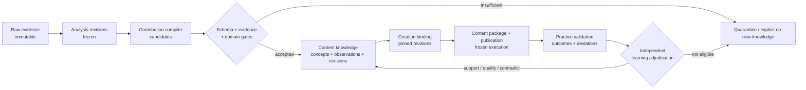

# Content Knowledge System V1 — Target Design

Status: **Confirmed**

Date: **2026-08-28**

Depends on: confirmed `docs/vision/signal-room-llm-wiki-vision.md` and `requirements.md`

Extends: creator research control plane, research learning model, Creation Workspace, and publishing contracts

## 1. Executive decision

V1 extends the existing local-first modular monolith with a **Content Knowledge bounded context**. It does not introduce a second report system or a Markdown folder as a parallel source of truth.

The canonical model remains structured and revisioned:

- immutable source evidence and frozen analysis revisions establish what was observed;
- `ResearchConcept`, `ResearchObservation`, and `ResearchConceptRevision` remain the core knowledge primitives;
- a new contribution manifest records exactly what each analysis revision did or did not add;
- semantic edges connect concepts without replacing evidence-backed observations;
- creation bindings pin the exact knowledge revisions used by a content package;
- practice validations stage first-party outcomes before an independent learning decision can affect knowledge;
- persisted SQL projections and FTS search make the knowledge usable in the product;
- Markdown and prose pages are exports or views, never an alternative truth source.

The key boundary is:

> The LLM may compile candidates, propose links, and draft revisions. Only deterministic validation plus an explicit domain decision may change canonical knowledge.

## 2. First-principles architecture



This design separates five layers with different authority:

| Layer | Primary object | Authority | Can directly change knowledge? |
|---|---|---|---|
| Raw evidence | artifacts and evidence refs | acquisition and evidence gates | No |
| Research dossier | analysis revision | research workflow | No |
| Content knowledge | concept, observation, revision | knowledge domain decision | Yes |
| Creation decision | binding and hypothesis | creator/editor | No |
| Practice validation | frozen execution and observed result | validation workflow | Only after adjudication |

Two writeback modes are deliberately different:

1. **Exploration writeback**: research or a query may propose a dossier, observation, relationship, or knowledge gap.
2. **Validation writeback**: a published content outcome may propose support, qualification, or contradiction after the planned hypothesis and execution deviations are frozen.

Neither mode lets chat history or model memory silently mutate canonical knowledge.

## 3. Bounded contexts and ownership

### 3.1 Existing contexts retained

- Creator Research owns acquisition, corpus selection, reconstruction, synthesis, and their frozen artifacts.
- Comparison owns pinned cross-creator projects and comparison revisions.
- Research Learning owns promotion rules, revision decisions, invalidation, and dependency impact.
- Publishing owns content packages, platform variants, runs, receipts, and operational publication state.

### 3.2 New Content Knowledge context

Content Knowledge owns:

- contribution manifests and contribution disposition;
- concept and observation query projections;
- explicit concept-to-concept semantic edges;
- gaps, conflicts, stale impact, and lineage views;
- creation knowledge bindings and creation hypotheses;
- practice-validation staging records.

It consumes pinned revisions from other contexts. It does not reach into their internal tables or infer truth from rendered reports.

### 3.3 Implemented package boundaries

```text
packages/knowledge/
  contracts.ts              Browser-safe public contract entrypoint
  src/contracts.ts          Runtime schemas and public domain types
  src/ports.ts              Explicit research boundary
  src/repository.ts         Persistence port
  src/service.ts            Knowledge and validation orchestration

packages/adapters/
  src/platform/database/sqlite-content-knowledge-repository.ts

src/server/
  content-knowledge.ts      Composition and compatibility facade
```

`packages/research/src/research-learning.ts` owns event replay and research
semantics. SQLite event persistence is implemented in `packages/adapters`; the
thin `src/server/research-learning.ts` file is only a compatibility/composition
facade, not a second domain implementation.

## 4. Canonical domain model

### 4.1 Existing primitives remain canonical

V1 retains:

- `ResearchConcept`: stable identity, kind, scope, status, and current revision;
- `ResearchConceptRevision`: append-only definition and decision history;
- `ResearchObservation`: evidence-bound support, qualification, or contradiction;
- `ResearchDependentConclusion`: downstream impact status.

The maturity ladder is a projection from typed objects and their states, not a free-text label. Raw facts remain evidence; observations belong to analysis subjects; creator, conditional, and track-wide patterns are concept scopes; creation hypotheses and first-party validation results remain distinct objects.

### 4.2 KnowledgeContributionManifest

Every eligible analysis revision produces one manifest, even when it adds no reusable knowledge.

Required fields:

```text
id
subjectType: video | creator | comparison
subjectId
analysisRevisionId
compilerPolicyVersion
inputFingerprint
status: staged | accepted | accepted_no_new_knowledge | quarantined | invalidated
contributionIds[]
quarantineReasons[]
createdAt / decidedAt
```

The idempotency identity is:

```text
(subjectType, subjectId, analysisRevisionId, compilerPolicyVersion)
```

An accepted analysis with no contribution must use `accepted_no_new_knowledge`; absence of a row means “not processed,” not “nothing learned.”

### 4.3 KnowledgeContribution

A contribution is a candidate-to-decision bridge, not a new synonym for observation.

```text
id
manifestId
disposition: create_concept | confirm | qualify | contradict | quarantined
targetConceptId?
createdConceptId?
observationId?
candidateStatement
evidenceRefs[]
decisionReason
```

Accepted `confirm`, `qualify`, and `contradict` contributions resolve to canonical observations. Quarantined contributions remain inspectable but never count toward promotion.

### 4.4 SemanticEdge

Canonical concept-to-concept relations are:

```text
depends_on | combines_with | competes_with | special_case_of | supersedes
```

Each edge pins its source concept revision and target concept revision, has `proposed | active | invalidated` status, provenance refs, a policy version, and a decision reason.

`supports`, `qualifies`, and `contradicts` are exposed as semantic relationships in the UI, but are derived from canonical observations. They are not duplicated as edge rows. This prevents two records from disagreeing about the same evidence relation.

### 4.5 KnowledgeBinding

A creation binding records a deliberate use of knowledge:

```text
id
contentPackageId
contentPackageSnapshotId
targetType: concept_revision | analysis_revision | evidence
targetId
usage: adopt | adapt | reject | test
rationale
status: current | stale_available | invalidated
createdAt
```

Bindings always pin a revision or immutable evidence identifier. They never point only to “the latest concept.” Historical packages preserve the original binding even after knowledge changes.

The current `sourceRefs[]` field remains readable for compatibility. New structured bindings are additive and become the preferred path.

### 4.6 CreationHypothesis

A hypothesis belongs to a frozen content-package snapshot and contains:

```text
statement
linkedBindingIds[]
expectedSignals[]
unavailableSignals[]
baselineDeclaration
confounders[]
```

Expected signals must distinguish public proxies such as likes and saves from unavailable private signals such as impressions, completion rate, and conversion. The system must not manufacture unavailable denominators.

### 4.7 PracticeValidation and PracticeObservation

`PracticeValidation` freezes:

- content-package snapshot and platform-variant revision;
- publication run and verified receipt where available;
- the hypothesis and baseline declared before evaluation;
- observed metrics with source and collection time;
- execution deviations and known confounders.

Its state machine is:

```text
draft
  -> evidence_ready
  -> adjudication_pending
  -> completed_no_promotion | promoted | blocked
  -> invalidated
```

A `PracticeObservation` is a staged candidate. After adjudication, it may emit a canonical `ResearchObservation` with `subjectType = practice_validation` and `origin = first_party_practice`.

Promotion policy partitions evidence by origin. First-party practice can support or challenge a concept, but it never masquerades as an additional distinct external video or creator when satisfying cross-creator thresholds.

## 5. Storage and consistency

### 5.1 Canonical write model

The content-knowledge context uses one SQLite transaction boundary for the
append-only Research Learning ledger, Knowledge decision ledger and their read
projections. On first compatible startup, legacy `research-learning.sqlite`
events are copied without changing payloads or IDs into
`content-knowledge.sqlite`; the legacy file remains a rollback source. A domain
command validates current state, appends typed events, and updates relational
read state atomically.

This is not a mandate to event-source the entire product. Publication jobs, acquisition runs, and other operational domains keep their existing models.

### 5.2 Logical SQLite tables

V1 adds logical tables equivalent to:

```text
knowledge_contribution_manifests
knowledge_contributions
knowledge_semantic_edges
knowledge_bindings
creation_hypotheses
practice_validations
practice_observations
knowledge_projection_concepts
knowledge_projection_lineage
knowledge_search_fts
```

The event ledgers and immutable research artifacts remain the authoritative
history. Projection and FTS tables are rebuildable through the service/API entry
documented in `docs/operations/knowledge-recovery.md`.

### 5.3 Projection strategy

Use a hybrid read model:

- persisted concept, contribution, gap, and lineage projections for stable product reads;
- SQL aggregation for small volatile counts;
- SQLite FTS5/BM25 for concept names, definitions, conditions, and observation statements;
- deterministic filters for maturity, scope, status, creator, platform, and staleness.

No vector database or graph database is introduced in V1. Semantic edges are stored relationally and traversed with bounded queries. Embeddings may later become a discovery aid but can never be the source of a relationship or revision decision.

## 6. Core flows

### 6.1 Analysis-to-knowledge contribution

1. A video, creator, or comparison analysis passes its existing publication gate.
2. The system freezes the analysis revision and evidence refs.
3. A compiler proposes contributions against current concept revisions.
4. Runtime schemas, evidence resolution, lens gates, and contribution policy validate the proposal.
5. The domain records accepted observations or quarantined candidates and always writes a manifest.
6. Projections update; the originating report shows its contribution block.

The compiler cannot read an unbounded filesystem, cannot resolve signed URLs as permanent evidence, and cannot directly set concept scope or status.

### 6.2 Knowledge compilation and promotion

Creator and cross-creator compilation use the same observation primitive. Existing promotion thresholds remain authoritative: eligible evidence, distinct-video and distinct-creator counts, tier distribution, deep reconstruction, counterexamples, and conditions are evaluated deterministically. An LLM may write the proposed synthesis and exclusions; it cannot waive a failed gate.

### 6.3 Knowledge-to-creation binding

1. In Creation Workspace, the user searches current concepts or enters from a research surface.
2. The system shows definition, conditions, contradictions, freshness, and exact current revision.
3. The user selects `adopt`, `adapt`, `reject`, or `test` and records rationale.
4. Saving a content-package snapshot pins the selected revisions and hypotheses.
5. If an upstream revision later changes, the historical snapshot remains intact and the working package receives `stale_available` impact.

### 6.4 Publication-to-practice validation

1. A published or verified draft run provides a frozen execution reference.
2. The user or an authorized adapter supplies observable results and their source.
3. The system compares the result with the predeclared hypothesis and baseline, displaying execution deviations.
4. A practice observation is staged as support, qualification, contradiction, or inconclusive.
5. Independent learning gates decide whether to create a canonical observation or complete without promotion.

The feedback flow evaluates a declared test; it does not infer causal truth from a successful post after the fact.

### 6.5 Query writeback and lint

Knowledge search and question answering are read-first. A useful synthesis may be saved only as a staged contribution with explicit source revisions. Lint produces queues for:

- unresolved contradiction;
- stale or invalid upstream evidence;
- orphan concept;
- missing exclusions or conditions;
- active semantic edge pinned to an obsolete revision;
- creation binding affected by a revision;
- researched analysis with no contribution manifest.

## 7. Staleness and invalidation

Deterministic invalidation propagates from evidence to analysis, observations, revisions, semantic edges, projections, and working creation bindings.

Rules:

- an invalid evidence ref invalidates or quarantines its dependent observation according to remaining support;
- a superseding analysis revision does not delete the old contribution; it marks whether the old contribution remains current;
- a concept revision preserves old bindings and marks affected working decisions `stale_available`;
- an invalidated concept revision invalidates active semantic edges pinned to it until re-adjudicated;
- material semantic changes require a new revision decision, not an automatic LLM rewrite;
- published history and receipts remain immutable even if their knowledge basis later becomes stale.

## 8. HTTP contract

All new routes use `/api/v1`. Existing research-learning and publishing routes remain compatibility aliases during migration.

### Query routes

```text
GET /api/v1/knowledge
GET /api/v1/knowledge/search?q=&scope=&status=&maturity=
GET /api/v1/knowledge/gaps
GET /api/v1/knowledge/:conceptId
GET /api/v1/knowledge/:conceptId/lineage
GET /api/v1/knowledge/contributions?subjectType=&subjectId=&analysisRevisionId=
GET /api/v1/content-packages/:packageId/knowledge-bindings
GET /api/v1/practice-validations/:validationId
```

### Command routes

```text
POST /api/v1/knowledge/compilations
POST /api/v1/knowledge/edges/:edgeId/adjudications
POST /api/v1/content-packages/:packageId/snapshots/:snapshotId/knowledge-bindings
POST /api/v1/content-packages/:packageId/snapshots/:snapshotId/hypotheses
POST /api/v1/publications/:runId/practice-validations
POST /api/v1/practice-validations/:validationId/submit
POST /api/v1/practice-validations/:validationId/adjudicate
```

Commands require idempotency keys. Responses return canonical IDs, pinned revision IDs, decision state, and projection lag if non-zero. They never return hidden chain-of-thought or treat generated prose as a committed decision.

## 9. Product and interaction design contract

### 9.1 Purpose and aesthetic direction

The Knowledge surface is a working editorial index: it should feel like an evidence desk and annotated field manual, not a dashboard card wall or an abstract graph demo.

It extends the confirmed industrial-editorial system:

- paper `#f3f0e8`, ink `#171713`, coal `#353630`;
- signal orange `#e4572e` for attention and change;
- evidence teal `#2e6b4f` for eligible/current state;
- muted `#8a887f` and ink-derived rules for hierarchy;
- `IBM Plex Sans Condensed` for reading and display;
- `IBM Plex Mono` for identifiers, revisions, status, and evidence metadata.

Square rules, typographic hierarchy, dense tables, and restrained color carry the interface. No gradients, decorative glass, floating pills, or generic metric-card grids are introduced.

### 9.2 Primary surfaces

V1 adds one top-level **Knowledge** navigation item and four coordinated surfaces:

1. **Knowledge index `/knowledge`** — left filters and saved views, main concept register, right health/gap rail.
2. **Concept detail `/knowledge/:id`** — a readable concept document with pinned current revision, conditions, exclusions, support/qualification/contradiction lanes, semantic neighbours, and revision history.
3. **Contribution block** — embedded in video, creator, and comparison reports; shows exactly what that frozen analysis added, changed, quarantined, or did not add.
4. **Decision and validation panels** — embedded in Creation Workspace and publication history; bind knowledge and review a declared hypothesis without turning creation into another research report.

### 9.3 First viewport and reading order

The index first viewport answers: “What do we currently believe, how strong is it, and what needs attention?” It shows compact totals by state, a sortable concept register, and unresolved contradictions/gaps. A graph is a secondary lineage inspection view, never the landing-page centerpiece.

The concept detail reading order is:

1. current definition, maturity, scope, status, and revision;
2. applicability conditions and explicit exclusions;
3. eligible support, qualification, contradiction, and quarantined evidence;
4. creator/video distribution and denominators;
5. semantic neighbours and downstream creation bindings;
6. revision decisions and stale impact.

### 9.4 Interaction and accessibility

- All status meaning is expressed by text and shape, not color alone.
- Evidence and revision references are keyboard reachable and open in the established evidence drawer.
- Tables preserve column headers and provide a stacked mobile reading order below 900px.
- The three-column desktop layout collapses to index → detail → evidence navigation on narrow screens.
- Loading, empty, quarantined, stale, and failed states are first-class designs.
- The UI never generates or commits knowledge on page load; compilation is an explicit command with visible state.

## 10. LLM and human authority

| Action | LLM | Deterministic system | Human/domain decision |
|---|---|---|---|
| Extract candidate observation | Propose | Validate schema and refs | Review when policy requires |
| Link to an existing concept | Propose | Validate target revision | Adjudicate ambiguity/conflict |
| Draft definition or exclusions | Propose | Validate completeness | Accept revision |
| Promote scope or status | Explain candidate | Compute gates | Commit eligible decision |
| Bind knowledge to creation | Suggest | Pin exact revision | Choose usage and rationale |
| Interpret practice result | Propose | Validate frozen plan/signals | Adjudicate writeback |
| Invalidate canonical knowledge | Flag impact | Propagate hard invalidation | Decide semantic revision |

LLM calls run behind a `KnowledgeCompiler` port with a versioned prompt/policy identifier. Inputs and outputs are bounded structured contracts. Provider-specific APIs do not enter domain modules.

## 11. Migration and backfill

1. Replay existing Research Learning events into the new projections and verify parity.
2. Add manifests for analyses that have resolvable immutable revisions and evidence refs.
3. Mark historical analyses without resolvable lineage as `legacy_unverified`; do not manufacture observations from prose alone.
4. Preserve `ContentPackage.sourceRefs[]`; structured bindings default to an empty set and are additive.
5. Keep old query routes until new and old reads match for a defined migration window.
6. Rebuild FTS and lineage projections entirely from canonical records as a release check.

No historical report is silently upgraded into knowledge simply because an LLM can summarize it.

## 12. Verification strategy

### Contract and policy tests

- runtime-schema rejection of unresolved evidence and unpinned revisions;
- manifest idempotency and explicit no-new-knowledge disposition;
- observation/edge non-duplication rules;
- promotion counts partitioned by origin;
- knowledge-binding staleness without historical mutation;
- practice-validation state transitions and unavailable-signal handling.

### Repository and projection tests

- atomic event append plus read-state update;
- replay and projection rebuild parity;
- FTS result determinism for stable fixtures;
- dependency invalidation and stale propagation;
- compatibility reads for existing research concepts and content packages.

### Integration tests

- one accepted video analysis produces a visible contribution manifest;
- seven posts can produce a creator-scoped pattern only when existing gates pass;
- a cross-creator concept can be traced back to distinct creators, videos, and evidence;
- a content package pins a concept revision and keeps it after that concept changes;
- a published test creates a staged validation and cannot directly revise a concept;
- an analysis with insufficient evidence remains visible as quarantined or accepted-no-new-knowledge.

### UI acceptance

- users can traverse post → contribution → concept → evidence and back;
- users can identify maturity, scope, conditions, contradictions, and revision without opening raw JSON;
- users can bind a revision from Creation Workspace and see stale impact later;
- the interface remains readable at 320px and keyboard operable.

## 13. Rollout sequence

This is an architecture sequence, not the implementation task list:

1. **Read foundation** — new repository ports, replayable projections, Knowledge index, and concept detail.
2. **Contribution visibility** — manifests plus embedded report contribution blocks.
3. **Creation decisions** — package snapshots, revision bindings, and hypotheses.
4. **Practice feedback** — frozen validation records, independent adjudication, and knowledge impact.

Each phase must remain useful and auditable without requiring the next phase to exist.

## 14. Resolved architecture decisions

| Question from requirements | V1 decision |
|---|---|
| Where are semantic edges stored? | Relational canonical records for concept-to-concept edges; observation relations are derived views. |
| How is an analysis contribution represented? | One idempotent manifest with zero or more contribution records and an explicit disposition. |
| Are Wiki pages canonical? | No. Structured concepts, observations, revisions, decisions, and edges are canonical; pages are projections/exports. |
| How does creation cite knowledge? | A frozen package snapshot pins exact concept/analysis/evidence revisions through typed bindings. |
| How do first-party outcomes enter learning? | Separate practice-validation staging, then independent adjudication into origin-labelled observations. |
| How is staleness handled? | Hard provenance changes propagate deterministically; semantic changes require a new adjudicated revision. |
| What search ships in V1? | SQLite FTS5/BM25 plus typed filters; no vector or graph database. |
| What gets backfilled? | Only records with resolvable revisions and evidence; prose-only legacy material remains unverified. |

## 15. Trade-offs and deferred alternatives

- **Markdown-first Wiki rejected**: easy to inspect, but cannot reliably enforce revision pinning, gates, atomic invalidation, or typed feedback.
- **Graph database deferred**: visually attractive but unnecessary for bounded relationship traversal and adds a second operational truth.
- **Vector-first retrieval deferred**: useful for discovery, not sufficient for provenance, negation, maturity, or decision authority.
- **Direct LLM canonical writes rejected**: reduces friction but destroys reviewability and makes silent knowledge drift likely.
- **Full event sourcing rejected**: the existing append-only knowledge decision ledger is retained without forcing unrelated operational domains into that model.

## 16. Requirement traceability

| Requirement | Design sections |
|---|---|
| R1 Unified knowledge maturity | 4.1, 9.3 |
| R2 Single-post contribution | 4.2–4.3, 6.1 |
| R3 Creator pattern synthesis | 6.2, 12 |
| R4 Cross-creator compilation | 4.7, 6.2 |
| R5 Knowledge workspace | 5.3, 9 |
| R6 Semantic relationships | 4.4, 7 |
| R7 Creation knowledge binding | 4.5–4.6, 6.3 |
| R8 Outcome feedback | 4.7, 6.4 |
| R9 Provenance and revision | 5, 7 |
| R10 LLM authority boundary | 2, 10 |
| R11 Cross-surface navigation | 9.2–9.4 |
| R12 Compatibility | 3, 11 |

## 17. Implementation handoff

This design was confirmed on 2026-08-28. Execution is governed by `tasks.md`, including migration checkpoints, test gates, and the first vertical slice.
