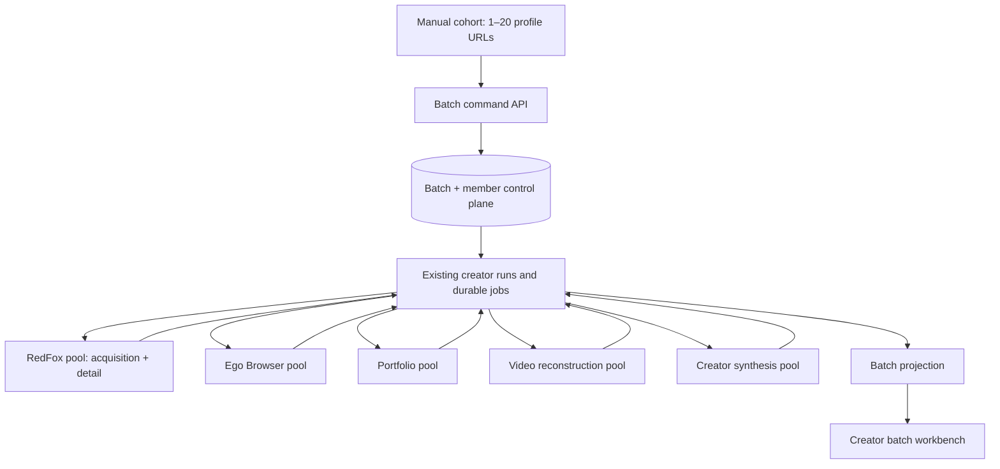

# Creator Batch Pipeline V2 — Design

Status: **Target architecture; executable and live state are recorded separately**

## 1. System shape



The batch is a control-plane aggregate, not an evidence aggregate. Creator runs continue to own job
state and immutable artifact references. A member connects one ordered input to the canonical creator
identity and selected run. Batch projection is rebuilt from these durable records.

## 2. Control-plane model

Control-plane records and projection:

```text
CreatorResearchBatch
  id, name, ordered runIds[1..20], createdAt
  operationKey + commandHash (idempotent create record)

CreatorResearchBatchProjection
  derived batch status and aggregate counts
  ordered items from the referenced creator runs
  profileUrl, adapter, creatorName, stage, coverage
  blockers, nextAction, dashboardPath, updatedAt
```

Recommended batch states are `queued | running | needs_user | partial | ready | failed | canceled`.
Member state is a projection from validation plus creator-run truth; it must not compete with the run's
canonical state machine. `partial` means at least one useful member result exists and at least one
required member is unresolved or terminally failed.

Validate the full command before run creation, then register its ordered run references under one
idempotent operation key and command hash. The batch does not persist a mutable copy of each run's
status; read projection derives member truth from the referenced runs after API retry or service restart.

## 3. Manual submission contract

The first product path accepts a label and an ordered array of 1–20 creator profile URLs. The command
normalizes URLs, rejects unsupported/duplicate inputs, and performs no paid provider work until the
whole request passes structural validation. Provider preference may be accepted only from an explicit,
allowlisted value; it is never inferred from a failing request.

The command returns the batch projection immediately. Long work is always asynchronous. Existing
single-creator creation and cache-aware reuse remain application services called by batch orchestration,
not duplicated route logic.

## 4. Five worker pools

| Pool | Capability selector | Default | Safe range | Isolation rule |
| --- | --- | ---: | ---: | --- |
| RedFox | `redfox` | 4 | 1–8 | acquisition and detail share one provider budget |
| Ego Browser | `ego-browser` | 1 | 1–2 | one slot per approved authenticated TaskSpace |
| Portfolio | `portfolio` | 1 | 1–4 | statistics/selection cannot block collection |
| Video reconstruction | `video` | 3 | 1–3 | preserves post-level isolation and atomic batch merge |
| Creator synthesis | `synthesis` | 2 | 1–4 | cannot block provider acquisition |

One supervisor owns a bounded slot array for each capability. A slot asks the repository for the next
eligible matching job, receives a lease under a stable worker/slot identity, and runs the existing
service execution boundary. No pool may claim a generic job solely because another pool is idle.

Configuration belongs to deployment environment, not source-specific localhost values. Limits are
parsed once, defaulted, and clamped. The batch does not reserve twenty slots; fairness remains at the
durable queue claim layer.

## 5. Job routing and provider policy

Acquisition and detail jobs must carry sufficient durable metadata to choose a capability before lease,
for example job kind plus explicit provider. Repository claim queries filter on that selector inside the
same transaction that grants the lease.

RedFox is preferred for scalable public account/inventory/detail acquisition where policy allows it.
Ego Browser remains the controlled authenticated/private-machine boundary and explicit fallback path.
A provider error records its real class and does not automatically migrate the job across pools.

## 6. Failure isolation

Member progress is independent. The scheduler has no batch-level fail-fast transition. A member in
`needs_user`, provider backoff, or terminal failure is excluded until eligible, while other member jobs
remain claimable. Aggregate counts are recomputed from member/run states.

Retries preserve existing idempotency and immutable artifacts:

- retry the failed job or member transition only;
- never recreate a ready run merely to refresh the batch;
- never rerun a video batch item already registered ready;
- expose terminal failure and the ready subset if bounded attempts are exhausted;
- treat unregistered executor output as disposable after lease loss.

## 7. RedFox checkpoint boundary

The first batch/worker implementation slice does not change RedFox detail enrichment from job-level
commit to item-level commit. Increasing RedFox concurrency improves throughput but does not by itself
protect already-paid results inside a failed multi-item request loop.

The follow-up checkpoint design should:

1. persist each accepted detail result as an immutable partial artifact/checkpoint;
2. record the exact post identity and provider request provenance;
3. resume only missing post identities after failure/restart;
4. assemble the final detail artifact from registered checkpoints;
5. prove no duplicate paid request under replay and no incomplete artifact published as complete.

Until those gates pass, UI and operations must disclose job-level retry semantics. The two-creator paid
smoke can proceed to characterize the boundary, but the remaining cohort up to 20 cannot be authorized.

## 8. Workbench projection

The workbench has two levels:

- aggregate: batch state, ready/active/blocked/failed counts, pool activity and paid-live phase;
- member: ordinal, creator identity, provider/current capability, stage/progress, blocker/failure, retry,
  and dossier navigation.

The frontend consumes one batch projection contract and does not infer state from timestamps or local
artifact paths. A ready member is useful even if the whole batch is partial. Empty, loading, error, and
restart-recovery states are first-class.

## 9. Verification strategy

Automated tests should prove:

- 1 and 20 accepted; 0, 21, invalid, and duplicate cohorts rejected atomically;
- each pool respects its capability and maximum, with deliberately delayed/reordered completions;
- a failed/blocked member does not prevent another member reaching ready;
- expired leases and API retries converge idempotently after restart;
- ready members/video items are not replayed by targeted retry;
- batch aggregate states and API/frontend projections remain honest;
- responsive workbench and empty/error states work at desktop and 390 px.

Paid-live verification is separate. Run two operator-approved creators and inspect provider calls/cost
and evidence. Before expansion, implement and test-verify RedFox item-level checkpoints; only then may
the operator authorize the remaining cohort up to 20. A test fixture or mock cannot turn
`live-unverified` into live-verified.
