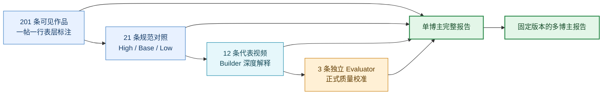

# Issue #55 验收记录：从单帖证据到单博主与多博主知识

状态：实现与真实数据验收记录  
日期：2026-09-02  
Issue：`Creator Research Cognitive Loop V1`

## 这次真正交付什么

系统不再把“12 条视频跑完”当作博主分析。三层证据各有不同职责：

## 单博主报告 V1 应回答什么

| 报告部分 | 必须回答 | 主要证据 |
| --- | --- | --- |
| 身份与范围 | 这个人是谁；本次看到了多少作品；停止原因和缺失是什么 | 主页、冻结 corpus、采集诊断 |
| 受众与价值 | 服务谁、解决什么问题、提供什么价值、为什么可能被信任 | 全量表层标注 + 深度样本 |
| 全量作品地图 | 主题、用户问题、标题承诺、形式与价值怎样分布；哪些无法归类 | `portfolio-annotations` |
| 表现分层 | High / Base / Low 分别出现什么；哪些只是相关性或混淆因素 | 固定 21 条与公开指标 |
| 内容内部 | 开头承诺、兑现、证明、信息密度、理解成本、画面和剪辑如何共同工作 | 代表视频 Builder / Evaluator |
| 逐帖解释 | 21 条对照记录各自是什么内容角色、证据成熟度和未知 | 固定 selection + post analyses |
| 节奏与演化 | 发布时间和题材阶段能支持什么；缺日期时不冒充趋势 | 公开详情 |
| 评论与需求 | 评论和作者回复揭示什么；未采集时明确缺失 | 评论 Artifact |
| 商业与边界 | 公开迹象支持哪些可能路径；哪些收入、转化和后台数据未知 | 可见 CTA / 作者主张 / unknown |
| 新认知 | 当前合同解释不了什么；下一轮要怎样支持、限定或反驳 | learning observation ledger |

报告主阅读路径使用中文。技术 ID、模型、指纹和 gate 保留在证据层，不占用正常阅读路径。

## 多博主报告 V1 应回答什么

| 报告部分 | 必须回答 |
| --- | --- |
| 可比性 | 平台、时间窗、样本量、公开指标、深度覆盖是否对齐 |
| 完整画像对照 | 每个博主的定位、受众、价值、信任、生命周期和可见商业路径 |
| 相对基本盘 | 每个账号自己的 High / Base / Low，不用原始点赞做粗暴排行榜 |
| 共同观察 | 哪些主题、形式、内容角色、证明和视觉语言重复出现 |
| 条件与反例 | 规律在什么条件下成立，谁不符合，哪些只是个别账号特征 |
| 信息处理差异 | 不同博主如何控制理解成本、信息密度、情绪和行动入口 |
| 明确缺口 | 当前报告为什么还不能形成某类共同机制 |
| 认知候选 | 哪些维度值得在 5 个、20 个博主中继续验证 |

多博主报告解释生态，不直接输出“我们该抄谁、下一条发什么”。创作决策进入独立工作台。

## 真实运行证据

### 黄金博主：清华姜学长

- 可见 corpus：201 条，采集因预算边界停止，不能宣称平台历史全量。
- 全量表层标注：201/201 ID 对齐；152 条至少在一个表层维度可分类，49 条整体未归类。
- 规范对照：21 条。
- 代表深度集：四组各 3 个成员，重叠只处理一次；12 条 Builder 完成。
- 独立评估：2 条通过，1 条带 findings，其他 Builder-only 保持 provisional。
- 前向 holdout：81.8 秒新视频通过 Builder、Terra medium Evaluator、19 项三镜检查与最终证据硬闸。
- 最新单博主报告：`creator-analysis.f66ae044e28f.json`，绑定
  `portfolio-annotations.0af7ac4e98eb.json`；确定性报告闸除正式深度覆盖外全部通过，状态保持
  `DOSSIER_READY / reviewable`，没有冒充 `WIKI_READY`。

holdout 首轮暴露的不是内容理解错误，而是来源引用合同歧义：Builder 使用了文件路径，确定性验证器要求
已注册来源 ID。合同改为“来源引用必须等于 `derivedSources` 中的精确 ID”后，两次有界合同修复收敛，
没有触发无限重跑。

### 第一份多博主报告

- 项目：`AI实操博主对照 V1.1｜AI红发魔女 × 秋芝2046`
- 固定两位博主各自的来源 Run 和 revision，不读取漂移的“最新报告”。
- 两边均有 21 条对照记录、12 条正式深度结果和完整博主画像。
- 报告显式说明时间窗、粉丝规模、账号年龄、投流和后台数据未对齐。
- 旧版精确字符串比较把 42 个自然语言角色全部当成特例；V1.1 将展示限制为每人 3 个代表例，并把
  “语义角色归一化尚未实现”列为正式 gap，没有假造共同机制。

## 认知 Loop 实际发现了什么

1. **先验证视觉连续性，再声明新载体。** 一条 High 样本在 105–109 秒把连续讲述者误报为插入卡片，
   同时污染内容还原、编导和剪辑判断。候选已隔离，未直接修改正式知识。
2. **跨博主模式前先做可审计的语义角色归一化。** 原描述、支持样本、反例和边界必须保留；不能只给
   相似度分数。
3. **采集到不等于完成作品地图。** 201 条清单和统计不能替代 201 条逐帖表层记录。新合同要求一帖一行，
   允许未知，不允许静默漏帖。

这三类发现分别来自单视频质量审阅、多博主报告审阅和单博主验收，说明认知 Loop 不是额外写一篇总结，
而是能改变下一轮输入合同、确定性闸和产品真相。

## 效率与质量

- 81.8 秒 holdout 首轮总耗时约 11 分 15 秒：Builder 约 7 分 20 秒，Evaluator 约 4 分钟。
- 绑定 201 条表层标注的博主综合耗时约 5 分 51 秒：15 次只读检查、1 次成品写入、无 compaction、
  无重试循环；会话峰值上下文约 8.4 万 token。
- Builder 的主要成本是完整时间线与画面检查，不是失败重试；Evaluator 的主要成本是独立读取完整证据包。
- 不以删掉时间线、证据引用或 unknown 换速度。下一步若压缩 Evaluator 输入，必须用同一批样本比较漏检率。
- `gpt-5.6-terra medium` 继续作为默认 Builder / Evaluator / 博主综合模型；Sol 只留给争议升级，Luna
  不负责正式 `VERIFIED`。

## 完成边界

V1 已建立可运行的生产、质量和认知三种 Loop。它不包含自动 Repairer、无限自修改、20 博主立即放量，
也不把单次认知候选自动晋升到 Skill 或 Wiki。5 → 20 放量属于后续波次，必须复用本次版本化 Artifact
和失败隔离合同。
