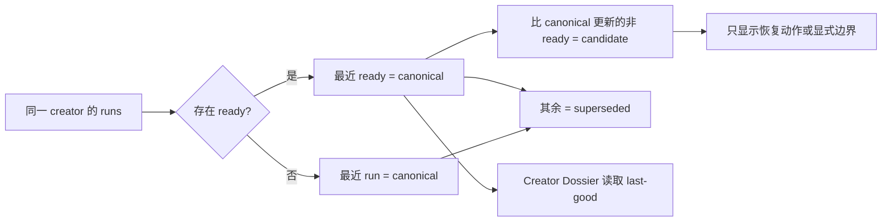

# Design

## 状态模型

每个 run 同时拥有两个正交维度：

- `authorityState`: `canonical | candidate | superseded`
- `resolutionState`: `ready | active | actionable | waiting_external | provisional | failed_terminal`

`authorityState` 回答“哪个版本服务产品”；`resolutionState` 回答“这个执行记录还需要什么”。

## 后端

- `buildCreatorRunOperations` 负责全局分组与 authority 投影。
- 原 `buildCreatorRunOperation` 继续负责单 run 的 coverage、gate、action 与 resolution。
- `/api/creator-run-operations` 返回增强后的 canonical/candidate/superseded 信息。
- Creator Dossier 在 canonical creator 路径上优先使用最近 ready + synthesis 的 run；显式 run id 仍可检查该 run。

## 前端

- 任务账本按 creator 分组。
- canonical 记录保持完整信息密度。
- candidate 显示 last-good 关系与恢复动作。
- superseded 历史记录折叠展示。
- 颜色继续使用 Signal Room 既有绿色、琥珀与砖红语义。

## 验证

- 单元测试覆盖重复 creator、ready last-good、更新 candidate、provisional close 与 Provider 二次失败。
- API 验证 19 run / 14 creator 的权威归类没有歧义。
- 浏览器覆盖 ready、candidate、superseded、waiting_external 和 provisional。
