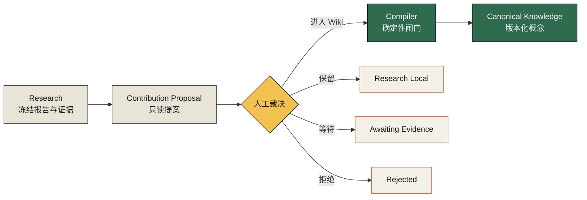
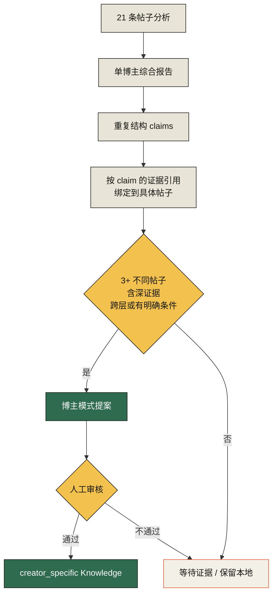

# Wave 3 设计

## 1. 权威边界

## 2. 单博主知识形成

## 3. 核心组件

| 组件 | 只负责什么 |
|---|---|
| Proposal Store | 保存冻结提案和裁决，不写概念 |
| Creator Compiler | 把重复结构及其帖子证据翻译为候选观察 |
| Reviewer API | 校验输入指纹并记录人工裁决 |
| Knowledge Compiler | 执行既有证据闸门、写 manifest 与概念版本 |
| Activation Workbench | 展示待审、原因、证据和最终去向 |

## 4. 数据原则

- 提案保存完整编译输入，因此审核时不会重新猜测。
- `expectedFingerprint` 防止操作者审核旧页面时应用了新版本。
- 非进入 Wiki 的裁决也必须持久化，成为可解释的“没有晋升”。
- 正式 manifest 仍是 Knowledge 写入的唯一审计凭证。

