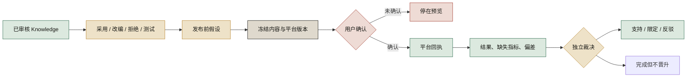

# Wave 4 机制设计

## 一条内容如何走完整闭环



## 三条不可破坏的边界

### 1. Knowledge 固定 revision

内容包保存的是当时使用的具体 revision，不跟随 Knowledge 的最新版漂移。旧 revision 即使后来过期，也必须还能查看。

### 2. 发布固定执行版本

平台版本一旦进入预览，任何正文或素材修改都会让旧发布任务失效。最终确认只对当前预览的 revision 有效。

### 3. 实践结果只能追加

结果先由内容复盘者提交候选判断，再由另一位裁决者决定是否进入第一方观察。发布结果不能直接修改 Knowledge。

## Lineage 读模型

Creation 页面不再只显示内部 ID。一个发布任务会返回一份组合视图：

```text
内容包快照
├── Knowledge bindings
│   └── 固定 revision
│       └── 研究观察 → analysis revision → Evidence refs
├── 创作假设
├── 冻结平台版本
└── 发布任务
    └── 实践验证 → 独立裁决
```

这份视图是只读投影。权威数据仍分别属于 Knowledge、Creation 和 Publication，不复制、不改写。
