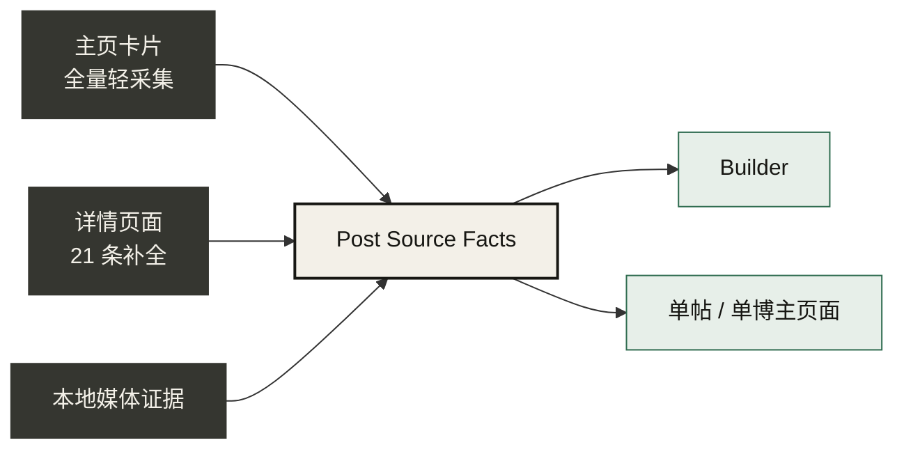

# 原帖事实层设计

`PostSourceFacts` 是只读投影，不新增第二套存储：它由 inventory、detail 和 media manifest 的版本化 artifact 组合产生。

每个字段都有 `available / partial / missing`。其中只有话题标签而没有叙述正文时，caption 为 `partial`。封面只使用已校验的本地封面 artifact；关键帧、逐字稿和模型摘要都不能拿来填补原帖字段，缺失时保持未知。

前端使用一个共享事实卡：左侧封面，右侧依次显示标题、发布正文、话题、时间、公开指标和证据来源。Builder 报告、逐字稿和 OCR 位于事实卡之后。
