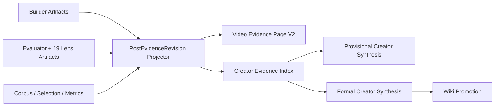

# Single Post Evidence Projection V2 — 设计

状态：Confirmed target architecture

## 1. 数据流



`PostEvidenceRevision` 是读模型，不复制或改写权威 Artifact。它把来源绑定、质量状态、页面友好结构和可导航证据索引集中在一个 schema 中。

## 2. 模块边界

| 模块 | 责任 |
| --- | --- |
| `packages/contracts` | Post evidence schema 与三轴状态合同 |
| `src/server/video-research.ts` | 从版本化 Artifact 构建 canonical read projection |
| `apps/web/.../VideoEvidencePage` | 只渲染 schema，不自行推断质量资格 |
| `packages/research/.../synthesis-coverage.ts` | 唯一的单博主综合 coverage policy |
| Creator synthesis | 分离 provisional eligibility 与 formal eligibility |

## 3. 状态模型

```text
buildState      = missing | built | failed | blocked
evaluationState = skipped | failed | findings | verified
promotionState  = provisional | wiki_eligible | ineligible
```

兼容聚合状态仍保留在 batch item 中，但页面和上层综合不得再从字符串自行猜测三轴状态。

## 4. 页面信息架构

1. 顶部 Truth Strip：Build / Evaluation / Promotion。
2. Quality Findings：Evaluator 发现与未闭环项，置于文章之前。
3. 三镜头：真实 CR/DL/VE 规则及证据。
4. 结构化内容：viewer change、knowledge units、relations、unknowns。
5. 画面与 transcript：可定位证据。
6. Article：存在时作为阅读模式；不存在时不显示占位失败。
7. 返回博主：保留 tier、账号基线与选样语境。

视觉继续使用现有 Industrial / Editorial 设计系统：IBM Plex、paper/ink、amber candidate、brick findings、teal verified。Lucide 是唯一图标库。

## 5. Creator synthesis 资格

权威 coverage policy 返回两个独立布尔值：

- `provisionalAllowed`：四个深度组均至少有 built/evaluated/verified 结果；允许内部暂定归纳。
- `formalAllowed`：正式要求的组覆盖由 verified 结果满足；只允许正式 creator synthesis 与 Wiki 下游。

现有正式队列暂时仍只在 `formalAllowed` 时启动。V2 首先发布 provisional eligibility 与证据索引，避免在尚未定义独立 provisional Artifact schema 前把候选混进正式 synthesis。

## 6. 测试策略

- 纯函数测试三轴状态与三镜头投影。
- 运行时 Artifact fixture 测试，证明 visual lens 不再硬编码 partial。
- coverage policy 表驱动测试：built、findings、verified、bounded media gap。
- 前端 model 测试质量文案与证据导航。
- 完整 `npm run verify`。
