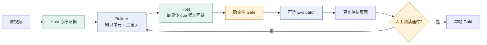
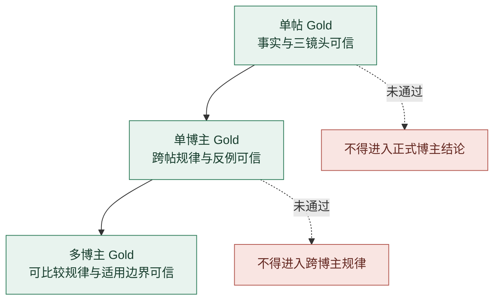

# 单帖金标准 · 设计

```mermaid
flowchart LR
  A[原视频] --> B[Host 冻结证据]
  B --> C[Builder<br/>知识单元 + 三镜头]
  C --> D[Host<br/>最具体 cue 候选回链]
  D --> E[确定性 Gate]
  E --> F[可选 Evaluator]
  F --> G[真实单帖页面]
  G --> H{人工阅读通过?}
  H -- 否 --> C
  H -- 是 --> I[单帖 Gold]

  classDef host fill:#E8F3EE,stroke:#2F7D5B,color:#173D2D;
  classDef model fill:#EAF0FA,stroke:#496A9B,color:#1F3557;
  classDef gate fill:#FFF2DA,stroke:#B67B1B,color:#5D3B08;
  class B,D host;
  class C,F model;
  class E,H gate;
```

## 关键边界

- Host 做机械确定性工作：冻结 cue、时间重叠、最具体单元选择、引用与图片路径。
- Builder 做语义工作：知识单元、歧义 cue、内容还原、编导逻辑、画面剪辑。
- Evaluator 只判断冻结候选，不修复。
- 页面验收是正式 Gate：读者看不到、看不懂或图片重复，都不算 Gold。

## 向上晋级

```mermaid
flowchart TD
  P[单帖 Gold<br/>事实与三镜头可信] --> C[单博主 Gold<br/>跨帖规律与反例可信]
  C --> M[多博主 Gold<br/>可比较规律与适用边界可信]
  P -. 未通过 .-> X[不得进入正式博主结论]
  C -. 未通过 .-> Y[不得进入跨博主规律]

  classDef gold fill:#E8F3EE,stroke:#2F7D5B,color:#173D2D;
  classDef stop fill:#F9E5E2,stroke:#B2554D,color:#642821;
  class P,C,M gold;
  class X,Y stop;
```
