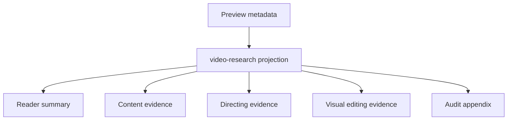

# 单帖读者报告 V2 · 设计

## 页面心智

默认页面是一份编辑型研究文章。证据紧邻结论；系统过程只存在于审计层。

## 模块边界

- `src/server/video-research.ts`：计算真实状态、读者摘要、证据引用到画面的解析。
- `packages/contracts/src/video-research.ts`：声明读者摘要与来源/分析状态。
- `apps/web/.../VideoEvidencePage.tsx`：只负责装配读者报告。
- 细分组件：Hero、章节导航、读者摘要、编导时间线、剪辑时间线、审计附录。
- `scripts/preview-three-lens-regression.ts`：接受真实原帖元数据，避免占位身份。

## 视觉合同

- Editorial / magazine；纸张、墨黑、证据绿、重点橙。
- 主阅读列优先，时间码形成左侧窄轨；关键图可突破正文列宽。
- 不使用常驻右栏，不使用等权卡片墙。
- 正文只显示人话；技术 ID 仅在审计层显示。

## 测试

- 投影测试：OCR/声音语义状态、真实元数据、读者摘要。
- 组件/DOM 测试：默认审计折叠、章节导航、可访问模式按钮。
- 浏览器：桌面与手机首屏、核心章节、折叠审计、图片、控制台、横向溢出。
