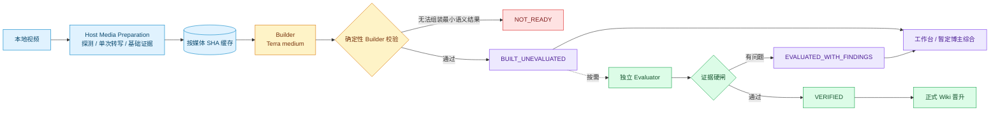
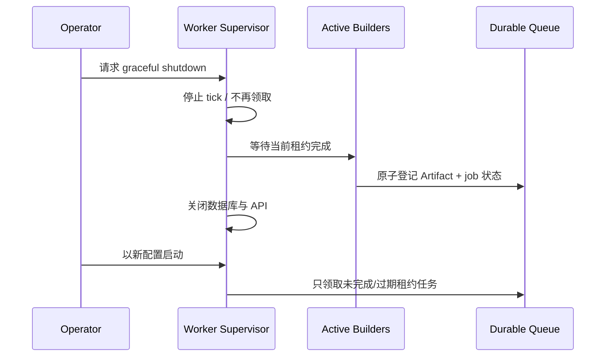

# Video Builder Fast Path V1 — 设计

状态：**Target architecture**

## 1. 心智模型



Builder 回答“视频里发生了什么、证据在哪里、可暂时推导什么”。Evaluator 回答“这份候选知识是否足够可靠，可以正式晋升”。两者不共享隐藏上下文，Evaluator 可稍后单独补做。

## 2. 执行策略

`video-content-reconstruction` 是单视频分析的唯一编排 Skill，显式依赖 `media-use`：

| 层 | 是否必选 | 责任 |
| --- | --- | --- |
| Host media preparation | 必选 | 解析媒体能力，单次转写并原子发布字幕，生成带 SHA 的 manifest 与冻结 evidence pack |
| Builder | 必选 | 完整时间线、载体检查、关键问题、证据化 reconstruction |
| Builder validator | 必选 | Schema、引用、媒体 SHA、必需产物和未知项纪律 |
| Evaluator | 可选 | 独立重看视频与证据，执行正式证据硬闸 |
| Renderer | 延迟 | 从固定 reconstruction 生成文章等阅读产物 |

默认运行配置：

```text
builder.model = gpt-5.6-terra
builder.reasoning_effort = medium
evaluation.policy = skip
article.render = deferred
worker.video_slots = 3（通过 2-video gate 后）
```

所有值由部署环境或任务合同提供。源代码不得写死本地代理；网络统一继承标准 `HTTPS_PROXY` / `HTTP_PROXY` / `ALL_PROXY`。

## 3. 状态与数据合同

单视频的两个质量轴要分开：

```text
buildState: queued | running | built | failed | blocked
evaluationState: skipped | queued | running | verified | findings
```

面向当前 API 的兼容聚合状态：

- `built_unevaluated`：Builder 与确定性校验通过，Evaluator 未运行；
- `evaluated_with_findings`：Builder 结果可用，Evaluator 已记录问题但未批准 Wiki 晋升；当前 API 暂时投影为 `ready + qualityWarningGateIds`；
- `verified`：Evaluator 与正式 gate 通过；
- `not_ready`：Host 无法从 Builder 语义增量组装出最小合法候选；
- `blocked`：媒体、Runner 或用户授权阻塞。

批任务新增 `builtPosts`、`verifiedPosts`、`pendingPosts`、`failedPosts`。旧 `readyPosts` 暂时映射 `verifiedPosts`，避免旧消费者把候选结果当正式结果。

## 4. 快速 Builder

Builder 的同步关键路径为：

1. Host 生成 `media-preparation.json`、字幕与冻结 evidence pack；
2. Builder 读取短角色合同和冻结输入，不再启动媒体 Provider；
3. Builder 对完整时间线做 carrier sweep 与非语音音频语义检查；
4. 根据语义变化生成 capture protocol；
5. 通过确定性脚本定向抽帧、OCR/UI 状态识别；
6. 精确去重、生成全局联系表并记录共享代表帧；
7. Builder 生成知识单元、关系、逐 cue 归责、语义 coverage 与 unknown；
8. Host 从冻结 evidence pack 注入逐字 transcript、代表帧、overlapping shots、稳定路径与指纹，并根据真实 OCR/取帧执行记录规范化机械状态；
9. Host 组装 `reconstruction.json`，运行 Schema、引用、媒体 SHA 与 Artifact 指纹校验；
10. 原子注册 `built_unevaluated` Artifact。

Evaluator 只有一个可选的新进程。它同时完成通用 GATE 和内容还原、编导逻辑、视觉剪辑三个 lens；宿主记录这一个真实 process run ID，并在前后比较全部冻结候选指纹。三 lens 是评估视角，不是三次伪造的独立执行。

质量晋升采用双层语义：Builder validator 决定“有没有可用候选”，Evaluator 决定“能否晋升 VERIFIED”。Evaluator 失败只能得到 `evaluated_with_findings`，不能晋升为 `verified`，但也不能删除或隐藏 Builder 候选。

Host 规范化是确定性组装而非 Repairer：它可以恢复冻结 transcript、统一机械布尔字段、注入稳定 Meta Gate ID 和派生 OCR 执行状态；它不得补写知识单元、改写语义陈述、消除 unknown 或代替 Evaluator 判断内容是否完整。

不是所有字幕 cue 都需要独占一张图片；多个 cue 可以引用同一个代表帧。但任何语义变化、UI 参数、前后对比或关键问题都不能因为去重被抹掉。

## 5. 排空与重启



现有 `ManagedRuntime.close()` 已具备 stop + stopAndWait 的基本语义。本实现要补充运行日志和测试，证明关闭期间不会补领新任务，且 Watcher 不会在排空前热重启服务。

## 6. 分阶段上线

1. 先排空当前 Worker，保留所有已生成 Artifact；
2. 完成合同、Executor、批投影和前端状态改造；
3. 测试模式验证 skip/single-pass 与重启恢复；
4. 单槽运行 2 个真实视频，比较旧/新耗时和证据覆盖；
5. 通过后恢复 3 槽，继续现有队列；
6. Luna medium 只做离线对照，不进入默认路径。
