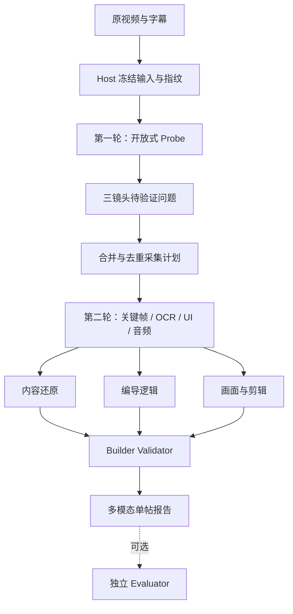

# 单帖三镜头 V2 · 设计

## 设计原则

采用“两轮、一底座、三镜头”：第一轮共同发现，第二轮合并取证，Builder 从同一冻结 revision 分别生产内容还原、编导逻辑、画面与剪辑。Evaluator 只对冻结候选进行独立检查。

## 模块边界

### Skill

- 更新主 Skill 与 Builder operator，明确三镜头属于 Builder 必交付。
- Probe 仍保持开放式，不新增封闭内容分类。
- Capture protocol 允许声明消费镜头和呈现意图。

### Contracts

- 使用新版本 Schema；旧 `video-reconstruction-1.0` 保持只读兼容。
- V2 增加三个 Builder Lens 结构及多模态 `contentBlocks`。
- 所有媒体引用只保存 Artifact ref、时间、裁切和说明，不复制媒体二进制。

### Host / Worker

- Host 继续拥有媒体准备、字幕/帧映射、Provider 生命周期、指纹和机械状态。
- Builder 读取冻结输入，输出语义结构。
- 合并规划器按媒体 revision、模式、时间和裁切请求去重，并保留 `consumers`。

### Validation

- 先验证共享证据和 Schema，再分别验证 CR / DL / VE。
- Builder Gate 与 Evaluator Gate 分离；前者证明“候选完整可读”，后者证明“可晋级正式知识”。
- 禁止用非空数组数量代替语义校验。

### API 投影

- V2 直接投影三个 Builder Lens。
- V1 继续使用兼容投影，但缺失字段必须保持 missing/partial。
- 页面状态以当前投影 Gate 为准，不能仅复用持久化旧 `ready`。

## 多模态内容模型

每个视觉 Block 包含：

- 类型；
- 标题与解释；
- 知识单元 ID；
- 一个或多个证据引用；
- 时间范围；
- 每张图的角色和关注点；
- 能证明与不能证明的边界；
- 可选裁切矩形。

图片进入正文的条件是它承担不可由文字无损替代的知识、状态、参数、对比、动作或视觉回报。装饰性重复图不进入正文。

## 编导模型

编导阶段不是内容时间线复述。每个阶段必须分别表达：

- 观众此刻的问题；
- 作者的编导任务；
- 新增认知或情绪；
- 证明/触发动作；
- 本段回报；
- 与下一阶段的连接。

顶层显式登记钩子、承诺、高潮、结尾闭合和观看前后变化。

## 画面剪辑模型

- `carriers`：画面与声音载体及职责；
- `semanticSegments`：意义段落，不等同技术镜头；
- `transitions`：载体/意义如何变化；
- `uiProcedureStates`：可见前中后与连续性边界；
- `rhythm`：按意义段落表达密度、停留与加速/减速；
- `resultFirstAt`：第一个真实可见回报；
- `audioRole`：只在有可读证据时描述；
- `missingBridges`：被剪掉或没有展示的执行环节。

## UI 设计规格

1. **Purpose Statement：** 单帖页是一份研究长文，而不是运行日志和卡片墙。用户先获得理解，再按需下钻证据。
2. **Aesthetic Direction：** Editorial / magazine，沿用 Signal Room 的研究刊物语言。
3. **Color Palette：** 使用现有品牌变量：暖纸色背景、墨黑正文、研究绿、警示琥珀；不引入紫色或蓝紫渐变。
4. **Typography：** 复用仓库已有 IBM Plex Sans Condensed 与 IBM Plex Mono Token，保持既有品牌一致性。
5. **Layout Strategy：** 非对称单主轴长文；图片穿插、并排或形成帧条，边界作为侧注；底层证据默认折叠。
6. **Platform：** React Web，继续使用现有 React Router、CSS 与 Lucide 图标，不额外引入 UI 框架。

## 测试策略

- Schema 与解析单测；
- 合并采集去重单测；
- 三镜头 Validator 正反例；
- API V1/V2 兼容投影；
- React 组件对八类 Block 的渲染测试；
- 页面缺失态、Builder-only、Evaluator findings、Verified 四种状态；
- 三条真实视频开发/Holdout 回归；
- 文件行数、仓库边界、类型、Lint、Build 全量检查。

## 兼容与发布

- 不原地改写旧 Artifact。
- 新 Builder 使用显式版本；旧 Reader 保持。
- 先验证三条视频，不批量重跑。
- 通过后优先升级赛博鸭，再决定秋芝及其他博主的重建策略。
