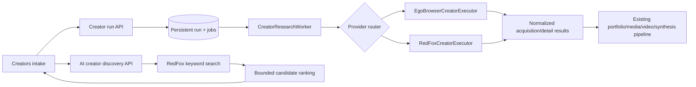

# Creator Provider Adapters — Design

## Architecture

The provider is frozen on `run.collectionPolicy.adapter`. A routing executor delegates `acquire` and `enrich` to the selected implementation. Downstream modules consume the existing normalized result contracts and remain provider-agnostic.

## Contracts

- `CreatorAcquisitionAdapter = "ego-browser" | "redfox"`.
- Create-run input becomes `{ profileUrl, adapter? }`, defaulting to `ego-browser`.
- Acquisition and detail executor inputs carry the frozen adapter.
- Ready results may use `taskSpaceId: null` for non-browser providers.
- Ready acquisition results may include normalized public-profile fields and explicit source references.
- Provider failures distinguish authentication, rate limiting, upstream availability, and invalid response shape.

## RedFox client

Server-only module responsibilities:

- read `REDFOX_API_KEY` and optional `REDFOX_BASE_URL` from process environment;
- set `REDFOX_API_KEY` only as an outbound header;
- enforce an abort timeout;
- parse JSON as `unknown`, validate/narrow it, and emit sanitized errors;
- count successful requests by endpoint for run/discovery usage reporting;
- never log request headers or raw signed media responses.

Initial documented endpoints:

- account: `POST /story/api/xhs/ability/accountDetail`;
- inventory: `POST /story/api/xhs/ability/userWorkList`;
- detail: `POST /story/api/xhs/ability/noteDetail`;
- discovery: `POST /story/api/xhs/ability/searchWork`.

## Mapping and provenance

- Account fields populate creator identity, bio, followers, likes-and-collections, displayed work count, and public identity anchors.
- Inventory fields map title, canonical note ID/URL, media type, likes, and visible public text. Additional RedFox-only counters remain source observations and are not misrepresented as impressions or outcomes.
- Detail fields map title, description, release time, cover candidate, and video candidate. Signed media URLs are held only in memory until the existing media resolver downloads and hashes them.
- Inventory artifacts record `provider: "redfox"` and stable RedFox endpoint source references, never the key.

## Discovery and ranking

The server searches a bounded default keyword set such as `AI工具`, `AIGC`, `AI视频`, `AI绘画`, and `人工智能`. Candidates are deduplicated by author UID. Ranking is explainable and based only on observed search evidence:

1. keyword coverage;
2. number of observed representative notes;
3. log-scaled public engagement;
4. video evidence availability.

The response includes the score components and representative note links. The UI never labels this as creator quality or commercial success.

## UI design

The existing Creators intake keeps the authenticated account as default. A compact industrial provider rail explains the trade-off:

- account session: strongest direct evidence, can require challenge handoff;
- RedFox: faster public inventory and details, paid per request, no silent account fallback.

Below the intake, an asymmetric discovery rail exposes bounded keywords, a discover action, usage count, and candidates with a deliberate “加入研究” action. It reuses the current Dashboard and Lucide icon language.

## Security

- `.env` remains ignored; `.env.example` documents only empty variables.
- `dotenv/config` is loaded only in server/CLI entrypoints as needed.
- No browser bundle reads the key.
- API errors are sanitized and do not include response bodies that could contain signed URLs.
- The user's disclosed key should be rotated if this conversation or its logs are shared externally.

## Testing

- Unit-test RedFox response mapping, pagination, request headers, missing values, errors, and discovery ranking with injected `fetch`.
- Service tests verify default provider, explicit provider, cache identity, and routing inputs.
- API tests verify request validation and that discovery never exposes credentials.
- Client tests cover provider labels and controlled payloads.
- Browser smoke-test the Creators route and candidate-to-run flow against a local mocked or real bounded backend.
