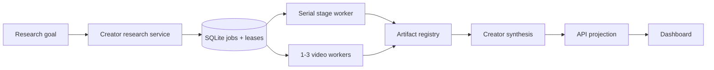

# Creator Research Architecture Design

## Shape

The system remains a modular TypeScript monolith. SQLite is the durable control plane, the local artifact store is the immutable evidence plane, and Express exposes read/write projections to the Dashboard. Worker implementations are replaceable adapters behind typed contracts.

## Control plane

`CreatorResearchService` owns run transitions, stage state, blockers, artifact pointers, and downstream enqueue decisions. `CreatorResearchWorker` provides a serial lane for acquisition/portfolio/synthesis and a bounded lane for independent video jobs. SQLite claims and heartbeats are the ownership authority.

Child executors emit lifecycle events containing role, child run ID, input revision, output revision, status, and error code. The run projection aggregates active and queued video work; the legacy singular worker field is not used to describe the whole concurrent batch.

## Evidence plane

The artifact store writes content-addressed JSON and text artifacts. Run records contain references, not embedded mutable research state. Video reconstruction directories are isolated by post ID, and the batch manifest is replaced by a new immutable revision after every terminal merge.

Every batch item carries an evaluator policy generation. Existing iterative outputs remain `legacy_iterative_repair`; new outcomes use `single_pass@37a03aae`. Synthesis may use content evidence from both groups but must preserve the policy boundary.

## Pipeline

The user-facing pipeline is six macro stages—preflight, inventory, tiering, deep capture, synthesis, Dashboard—projected from thirteen explicit internal research stages. Full-corpus data precedes sampling. Deep capture uses one reconstruction and one independent evaluator per representative video.

Quality issues are evidence warnings. Retry is reserved for unreadable media, missing/corrupt required output, or infrastructure failure. This prevents evaluation from becoming an automatic repair loop.

## Concurrency

`SELF_MEDIA_VIDEO_CONCURRENCY` configures one to three slots, default three. Each slot has a stable worker identity. Video jobs write only to their post directory. Terminal application reloads the latest run and batch before merging; idempotency keys prevent duplicate item application and duplicate synthesis enqueue.

The implementation deliberately avoids a distributed queue. The critical terminal merge has no asynchronous boundary inside the service process, while SQLite transactions protect job ownership.

## Blocker attribution

Acquisition normalizes post identity to a canonical `/explore/<postId>` URL and performs one bounded automatic recovery for internal navigation failures. Redirect loops and unknown page shapes are internal blockers. `needs_user` is reserved for observed login, captcha, safety challenge, or explicit user takeover signals.

The recovery path reuses the registered inventory and rebuilds downstream selection instead of reacquiring the creator profile.

## Projection

API readers hydrate run, batch, policy, and child-lifecycle state from registered storage. Dashboard views consume those projections and display aggregate concurrency, provenance links, warnings, blockers, and completion state. Legacy artifact readers remain compatibility adapters, not the canonical write path.

## Verification

The suite combines contract tests, repository/lease tests, reordered-concurrency tests, browser blocker classification tests, artifact-store immutability tests, synthesis policy-boundary tests, API projection tests, build, lint, and skill-manifest validation.
