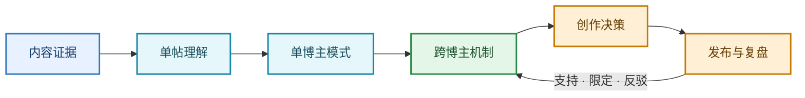
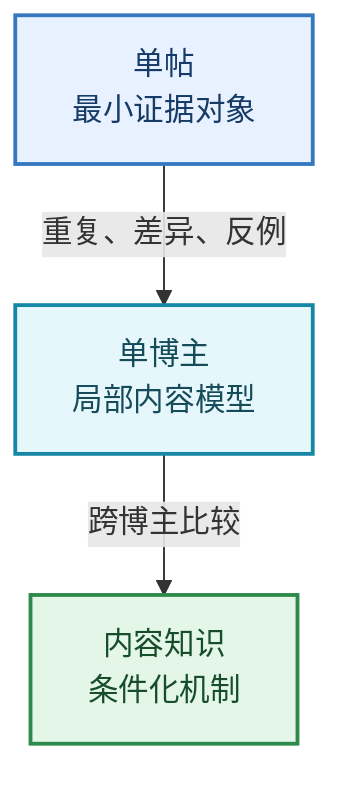
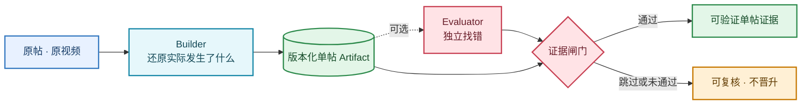
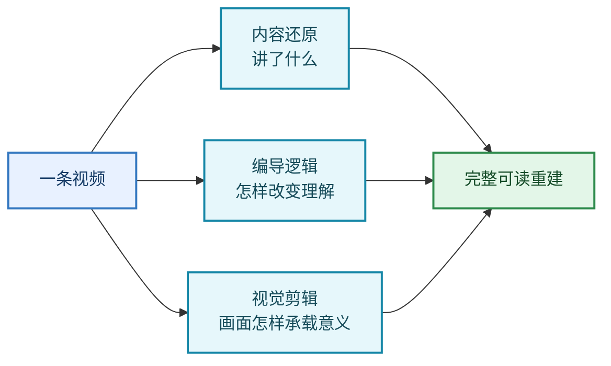
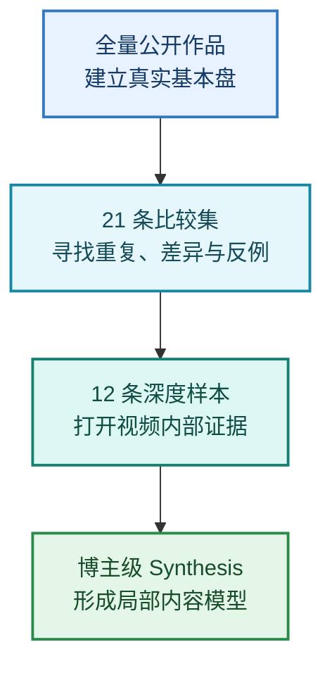
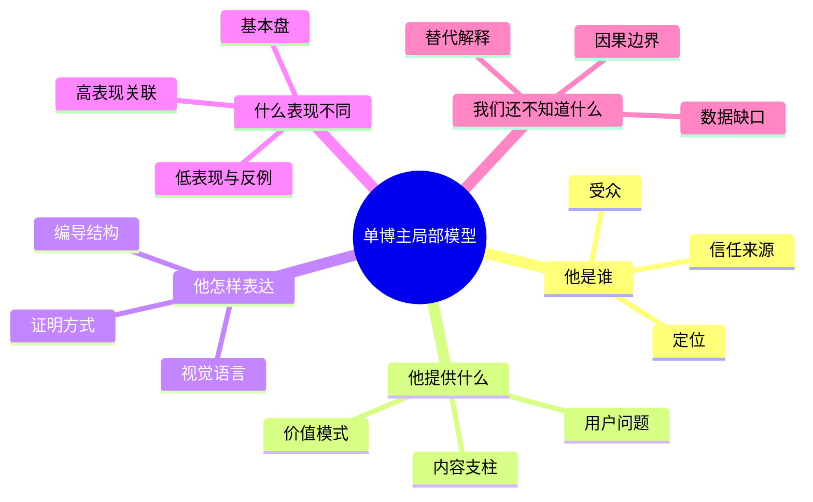
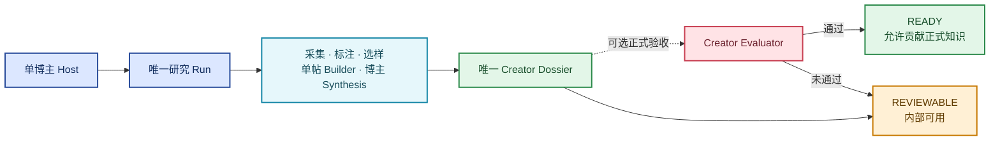
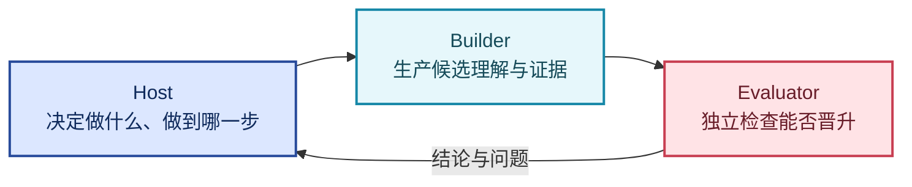

# Signal Room 核心心智模型

Status: **Current mental model**  
Scope: **只解释“大目标、单帖、单博主”之间的关系；字段、运行状态与实现细节由 Schema、代码和架构文档负责。**

## 1. 我们最终在构建什么

> Signal Room 把可追溯的内容证据，逐层编译成可修订的知识，再用真实创作结果反过来校正知识。

不是“报告越来越多”，而是“下一次判断不再从零开始”。

## 2. 三种对象，不是三种页面

- 单帖回答：**这条内容具体做了什么？**
- 单博主回答：**这个人在当前样本中稳定地会什么？**
- 内容知识回答：**什么机制在什么条件下可能跨个案复用？**

## 3. 单帖的心智模型

### 3.1 单帖不是摘要，是证据化重建

### 3.2 Builder 同时看三件事

单帖只能产生观察与候选机制，不能因为点赞高就生成“通用规律”。

## 4. 单博主的心智模型

### 4.1 三层漏斗

### 4.2 博主级综合回答什么

博主结论只在“这个博主 + 当前样本 + 当前时间窗口”内成立。

### 4.3 一个博主怎样完成

## 5. Host、Builder、Evaluator

| 角色 | 只负责 |
| --- | --- |
| Host | 合同、编排、版本、恢复、最终状态 |
| Builder | 基于证据生产候选 Artifact |
| Evaluator | 独立找错与判断是否晋升，不自动修复 |

## 6. 知识晋升边界

```mermaid
flowchart LR
    FACT["原始事实"] --> POST["单帖观察"]
    POST --> CREATOR["博主级模式"]
    CREATOR --> CONDITIONAL["跨博主条件性规律"]
    CONDITIONAL --> HYPOTHESIS["创作假设"]
    HYPOTHESIS --> PRACTICE["自有验证结果"]

    classDef evidence fill:#E8F1FF,stroke:#3478C0,color:#153B66,stroke-width:2px;
    classDef research fill:#E6F7FB,stroke:#1687A7,color:#164B59,stroke-width:2px;
    classDef knowledge fill:#E3F6E8,stroke:#2C8A4B,color:#174D2A,stroke-width:2px;
    classDef action fill:#FFF0D5,stroke:#C77800,color:#603B00,stroke-width:2px;
    class FACT evidence;
    class POST,CREATOR research;
    class CONDITIONAL knowledge;
    class HYPOTHESIS,PRACTICE action;
```

每一层都需要自己的证据门槛；页面位置和模型语气不能代替晋升。

## 7. 唯一权威

| 问题 | 唯一权威 |
| --- | --- |
| 长期为什么做 | [LLM Wiki Vision](signal-room-llm-wiki-vision.md) |
| 核心对象怎样理解 | 本文 |
| 当前产品已经做到什么 | [Current Product](../product/current-product.md) |
| 博主流水线怎样实现 | [博主研究与视频重建架构](../architecture/creator-research-pipeline.md) |
| 字段与可执行状态 | Schema、代码与测试 |

## Read next

- 想理解长期方向：[Signal Room LLM Wiki Vision](signal-room-llm-wiki-vision.md)
- 想理解运行系统：[博主研究与视频重建架构](../architecture/creator-research-pipeline.md)
- 想确认当前能力：[Signal Room Current Product](../product/current-product.md)
